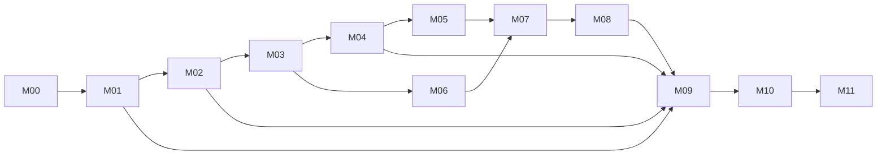

# 原子任务 DAG 与双向追踪矩阵

## 1. 冻结来源与计数

本文件机械归并 01–12 号任务卡与总计划 21 号 registry，只建立反向索引，不改变 canonical owner。全部任务初态为 `planned`，能力为 `UNVERIFIED`。

- 12 个里程碑文件、80/80 DEV、187 个唯一 WU、80 个同号 EVD。
- 102/102 Requirement、133/133 exact test。
- 上游 `R3B-20260711-085312-FINAL` manifest SHA-256：`7763d20d4f46c5d62b249bc8a080a761cfbe8390cab7d0a55748743af0cc46ae`。
- 当前：`F2S-GATE-DEVPLAN-001=NOT_RUN`、`implementationAuthorized=false`、`releaseAuthorized=false`。

### 1.1 输入文件 hash

| 文件 | SHA-256 |
| --- | --- |
| 01-M00-决策与可行性Spike.md | `10ad6831c429cfab0b3e1deee3e45dae84b9f6c618ea1ecc3481ee5f2b70ffba` |
| 02-M01-工程骨架与工具链.md | `722fe5560a61f9e82ce5ec72b7bedfccd5dc2a45fd80f0e2121d9baf36f7474f` |
| 03-M02-领域存储与协议基线.md | `7a07afabe387974cf23de3119572d875b4143b2f4c726004a296a2c4901f4441` |
| 04-M03-项目导入母版与审批.md | `d003f5d81df8b166005645eae711b8dabe09f2868d0e1e8f35b9b2397302627f` |
| 05-M04-分层与素材修复.md | `0b6847b638937169b08a5dc34a7813dbea811258ce595d94649378b803abd1a4` |
| 06-M05-Rig编辑与审批.md | `ac5da63a32d1792d48d5e6b59fc5f4104f7239c0753a23c62e7bee788b32442d` |
| 07-M06-动作内容与提示词.md | `f8f01a4f3c8c42dcd69d6af164618a87a78a3f92a64c0aa7d3d9e06964e14e2d` |
| 08-M07-动画编辑预览与玩法标记.md | `5a127c4ba5d61839cd782598c1ab8d8b440e97dbcb953303edae142e76d384ce` |
| 09-M08-导出与Spine42适配.md | `702af3a9ef39eedb11dddbf35ae675cde000a7f8b0ee1591e4e708b0aeed98cf` |
| 10-M09-安全AI远程GPU与质量.md | `d5f0201d7a8688356fd95fe44c010b438395a1a410923597966bbeffb44219d0` |
| 11-M10-Windows打包入口更新.md | `a9900387361448e57109b8146e7686bfcdfd2580b6907a76e6d1636ed945bd81` |
| 12-M11-验收封账与发布候选.md | `c542ae7fe72f48f425f1c1bd0d55ed8c4a9aaaff45182e0978e035f34be58b06` |

## 2. 里程碑 DAG 与波次



M04/M06 可并行；M05 等待 M04；M07 同时等待 M05/M06；M09 只读消费 M01/M02/M04/M08 的安全与质量合同。

| Milestone | 文件 | DEV | WU | EVD | Wave |
| --- | --- | ---: | ---: | ---: | --- |
| M00 | 01-M00-决策与可行性Spike.md | 5 | 14 | 5 | W0 |
| M01 | 02-M01-工程骨架与工具链.md | 5 | 12 | 5 | W1 |
| M02 | 03-M02-领域存储与协议基线.md | 8 | 21 | 8 | W2 |
| M03 | 04-M03-项目导入母版与审批.md | 6 | 15 | 6 | W3 |
| M04 | 05-M04-分层与素材修复.md | 7 | 15 | 7 | W4A |
| M05 | 06-M05-Rig编辑与审批.md | 8 | 16 | 8 | W5A |
| M06 | 07-M06-动作内容与提示词.md | 8 | 16 | 8 | W4B |
| M07 | 08-M07-动画编辑预览与玩法标记.md | 8 | 18 | 8 | W6 |
| M08 | 09-M08-导出与Spine42适配.md | 8 | 17 | 8 | W7 |
| M09 | 10-M09-安全AI远程GPU与质量.md | 7 | 17 | 7 | W8 |
| M10 | 11-M10-Windows打包入口更新.md | 6 | 14 | 6 | W9 |
| M11 | 12-M11-验收封账与发布候选.md | 4 | 12 | 4 | W10 |

## 3. 80 DEV—WU—REQ—TST—EVD 矩阵

| DEV / 冻结短名 | 文件 | 完整 WU | FR/NFR | Exact tests | EVD | dependsOn DEV | 状态 |
| --- | --- | --- | --- | --- | --- | --- | --- |
| F2S-DEV-M00-001<br>决策与精确工具链基线 | 01-M00-决策与可行性Spike.md | F2S-WU-M00-001-01<br>F2S-WU-M00-001-02<br>F2S-WU-M00-001-03 | F2S-NFR-COMPAT-001<br>F2S-NFR-MAINT-001 | F2S-TST-E2E-007<br>F2S-TST-E2E-COMPAT-001<br>F2S-TST-E2E-MAINT-001 | F2S-EVD-M00-001 | — | planned / UNVERIFIED |
| F2S-DEV-M00-002<br>许可证与外部系统清单 | 01-M00-决策与可行性Spike.md | F2S-WU-M00-002-01<br>F2S-WU-M00-002-02<br>F2S-WU-M00-002-03 | F2S-NFR-LIC-001<br>F2S-NFR-LIC-002 | F2S-TST-E2E-LIC-001<br>F2S-TST-E2E-LIC-002 | F2S-EVD-M00-002 | F2S-DEV-M00-001 | planned / UNVERIFIED |
| F2S-DEV-M00-003<br>合法合成fixture基线 | 01-M00-决策与可行性Spike.md | F2S-WU-M00-003-01<br>F2S-WU-M00-003-02 | F2S-FR-REPORT-001<br>F2S-NFR-MAINT-001 | F2S-TST-E2E-005<br>F2S-TST-E2E-MAINT-001 | F2S-EVD-M00-003 | F2S-DEV-M00-002 | planned / UNVERIFIED |
| F2S-DEV-M00-004<br>8GB GPU与AppContainer可行性Spike | 01-M00-决策与可行性Spike.md | F2S-WU-M00-004-01<br>F2S-WU-M00-004-02<br>F2S-WU-M00-004-03 | F2S-FR-COMP-002<br>F2S-NFR-PERF-006<br>F2S-NFR-SEC-005 | F2S-TST-E2E-PERF-006<br>F2S-TST-E2E-SEC-005<br>F2S-TST-RGPU-005 | F2S-EVD-M00-004 | F2S-DEV-M00-002<br>F2S-DEV-M00-003 | planned / UNVERIFIED |
| F2S-DEV-M00-005<br>PSD与Spine 4.2.43 Spike | 01-M00-决策与可行性Spike.md | F2S-WU-M00-005-01<br>F2S-WU-M00-005-02<br>F2S-WU-M00-005-03 | F2S-FR-EXP-002<br>F2S-FR-EXP-003<br>F2S-NFR-SPINE-001 | F2S-TST-CONTRACT-005<br>F2S-TST-E2E-SPINE-001<br>F2S-TST-GOLD-001 | F2S-EVD-M00-005 | F2S-DEV-M00-001<br>F2S-DEV-M00-002<br>F2S-DEV-M00-003 | planned / UNVERIFIED |
| F2S-DEV-M01-001<br>仓库与workspace骨架 | 02-M01-工程骨架与工具链.md | F2S-WU-M01-001-01<br>F2S-WU-M01-001-02 | F2S-NFR-MAINT-001 | F2S-TST-060 | F2S-EVD-M01-001 | F2S-DEV-M00-001<br>F2S-DEV-M00-002 | planned / UNVERIFIED |
| F2S-DEV-M01-002<br>精确工具链与锁文件 | 02-M01-工程骨架与工具链.md | F2S-WU-M01-002-01<br>F2S-WU-M01-002-02<br>F2S-WU-M01-002-03 | F2S-NFR-COMPAT-001<br>F2S-NFR-MAINT-001 | F2S-TST-072<br>F2S-TST-E2E-COMPAT-001<br>F2S-TST-E2E-LIC-001 | F2S-EVD-M01-002 | F2S-DEV-M00-001<br>F2S-DEV-M00-002<br>F2S-DEV-M01-001 | planned / UNVERIFIED |
| F2S-DEV-M01-003<br>桌面壳与简中资源 | 02-M01-工程骨架与工具链.md | F2S-WU-M01-003-01<br>F2S-WU-M01-003-02 | F2S-FR-COMP-001<br>F2S-NFR-I18N-001 | F2S-TST-070<br>F2S-TST-E2E-UX-001 | F2S-EVD-M01-003 | F2S-DEV-M01-001<br>F2S-DEV-M01-002 | planned / UNVERIFIED |
| F2S-DEV-M01-004<br>开发态根目录入口 | 02-M01-工程骨架与工具链.md | F2S-WU-M01-004-01<br>F2S-WU-M01-004-02 | F2S-FR-APP-001 | F2S-TST-070<br>F2S-TST-071 | F2S-EVD-M01-004 | F2S-DEV-M01-003 | planned / UNVERIFIED |
| F2S-DEV-M01-005<br>环境诊断、错误展示与CI | 02-M01-工程骨架与工具链.md | F2S-WU-M01-005-01<br>F2S-WU-M01-005-02<br>F2S-WU-M01-005-03 | F2S-FR-COMP-002<br>F2S-NFR-COMPAT-001<br>F2S-NFR-MAINT-001 | F2S-TST-061<br>F2S-TST-072<br>F2S-TST-E2E-UX-001 | F2S-EVD-M01-005 | F2S-DEV-M01-002<br>F2S-DEV-M01-003<br>F2S-DEV-M01-004 | planned / UNVERIFIED |
| F2S-DEV-M02-001<br>版本化schema | 03-M02-领域存储与协议基线.md | F2S-WU-M02-001-01<br>F2S-WU-M02-001-02 | F2S-FR-SPEC-001<br>F2S-NFR-MAINT-001 | F2S-TST-060<br>F2S-TST-CONTRACT-001<br>F2S-TST-CONTRACT-004<br>F2S-TST-PROP-002 | F2S-EVD-M02-001 | F2S-DEV-M01-001<br>F2S-DEV-M01-002 | planned / UNVERIFIED |
| F2S-DEV-M02-002<br>Rule/Gate/Decision、priority truth与anti-downgrade不变量 | 03-M02-领域存储与协议基线.md | F2S-WU-M02-002-01<br>F2S-WU-M02-002-02<br>F2S-WU-M02-002-03 | F2S-FR-PREV-004<br>F2S-NFR-LIC-002<br>F2S-NFR-MAINT-001<br>F2S-NFR-REL-001<br>F2S-NFR-UX-002 | F2S-TST-090<br>F2S-TST-093<br>F2S-TST-096<br>F2S-TST-099<br>F2S-TST-PROP-002<br>F2S-TST-UNIT-001 | F2S-EVD-M02-002 | F2S-DEV-M02-001 | planned / UNVERIFIED |
| F2S-DEV-M02-003<br>Command/Undo/Redo | 03-M02-领域存储与协议基线.md | F2S-WU-M02-003-01<br>F2S-WU-M02-003-02 | F2S-NFR-REL-003 | F2S-TST-094<br>F2S-TST-PROP-002<br>F2S-TST-UNIT-003 | F2S-EVD-M02-003 | F2S-DEV-M02-001<br>F2S-DEV-M02-002 | planned / UNVERIFIED |
| F2S-DEV-M02-004<br>Job引擎与终态仲裁 | 03-M02-领域存储与协议基线.md | F2S-WU-M02-004-01<br>F2S-WU-M02-004-02 | F2S-FR-COMP-003<br>F2S-NFR-PERF-004<br>F2S-NFR-REL-005 | F2S-TST-095<br>F2S-TST-IPC-004<br>F2S-TST-UNIT-005 | F2S-EVD-M02-004 | F2S-DEV-M02-003 | planned / UNVERIFIED |
| F2S-DEV-M02-005<br>IPC mock与契约 | 03-M02-领域存储与协议基线.md | F2S-WU-M02-005-01<br>F2S-WU-M02-005-02 | F2S-FR-COMP-003<br>F2S-NFR-MAINT-001 | F2S-TST-061<br>F2S-TST-093<br>F2S-TST-CONTRACT-002<br>F2S-TST-IPC-001<br>F2S-TST-IPC-003<br>F2S-TST-IPC-004 | F2S-EVD-M02-005 | F2S-DEV-M02-001<br>F2S-DEV-M02-004 | planned / UNVERIFIED |
| F2S-DEV-M02-006<br>项目存储/CAS、治理streams/registries与clock事务 | 03-M02-领域存储与协议基线.md | F2S-WU-M02-006-01<br>F2S-WU-M02-006-02<br>F2S-WU-M02-006-03<br>F2S-WU-M02-006-04 | F2S-FR-PROJ-003<br>F2S-NFR-LIC-002<br>F2S-NFR-PERF-007<br>F2S-NFR-REL-001<br>F2S-NFR-REL-002<br>F2S-NFR-SEC-001 | F2S-TST-063<br>F2S-TST-094<br>F2S-TST-099<br>F2S-TST-110<br>F2S-TST-111<br>F2S-TST-112<br>F2S-TST-113<br>F2S-TST-114<br>F2S-TST-118<br>F2S-TST-120<br>F2S-TST-E2E-006<br>F2S-TST-E2E-007 | F2S-EVD-M02-006 | F2S-DEV-M02-001<br>F2S-DEV-M02-002<br>F2S-DEV-M02-003 | planned / UNVERIFIED |
| F2S-DEV-M02-007<br>恢复与迁移 | 03-M02-领域存储与协议基线.md | F2S-WU-M02-007-01<br>F2S-WU-M02-007-02<br>F2S-WU-M02-007-03 | F2S-FR-PROJ-004<br>F2S-FR-PROJ-006<br>F2S-NFR-MAINT-001<br>F2S-NFR-REL-005 | F2S-TST-112<br>F2S-TST-115<br>F2S-TST-116<br>F2S-TST-117<br>F2S-TST-CONTRACT-004 | F2S-EVD-M02-007 | F2S-DEV-M02-006 | planned / UNVERIFIED |
| F2S-DEV-M02-008<br>审计、错误registry与可观测事件 | 03-M02-领域存储与协议基线.md | F2S-WU-M02-008-01<br>F2S-WU-M02-008-02<br>F2S-WU-M02-008-03 | F2S-FR-PROJ-005<br>F2S-NFR-OBS-001 | F2S-TST-061<br>F2S-TST-063<br>F2S-TST-118 | F2S-EVD-M02-008 | F2S-DEV-M02-001<br>F2S-DEV-M02-006 | planned / UNVERIFIED |
| F2S-DEV-M03-001<br>项目创建与打开 | 04-M03-项目导入母版与审批.md | F2S-WU-M03-001-01<br>F2S-WU-M03-001-02 | F2S-FR-PROJ-001<br>F2S-FR-PROJ-002 | F2S-TST-111<br>F2S-TST-112<br>F2S-TST-116<br>F2S-TST-E2E-001 | F2S-EVD-M03-001 | F2S-DEV-M02-003<br>F2S-DEV-M02-006<br>F2S-DEV-M02-007<br>F2S-DEV-M02-008 | planned / UNVERIFIED |
| F2S-DEV-M03-002<br>图片导入 | 04-M03-项目导入母版与审批.md | F2S-WU-M03-002-01<br>F2S-WU-M03-002-02 | F2S-FR-IMP-001<br>F2S-FR-IMP-003 | F2S-TST-100<br>F2S-TST-E2E-001<br>F2S-TST-PROP-003 | F2S-EVD-M03-002 | F2S-DEV-M02-001<br>F2S-DEV-M02-006<br>F2S-DEV-M03-001 | planned / UNVERIFIED |
| F2S-DEV-M03-003<br>输入preflight | 04-M03-项目导入母版与审批.md | F2S-WU-M03-003-01<br>F2S-WU-M03-003-02 | F2S-FR-IMP-002 | F2S-TST-100<br>F2S-TST-PROP-003 | F2S-EVD-M03-003 | F2S-DEV-M03-002 | planned / UNVERIFIED |
| F2S-DEV-M03-004<br>母版与StyleSpec | 04-M03-项目导入母版与审批.md | F2S-WU-M03-004-01<br>F2S-WU-M03-004-02 | F2S-FR-IMP-004 | F2S-TST-E2E-001<br>F2S-TST-PROP-003 | F2S-EVD-M03-004 | F2S-DEV-M02-003<br>F2S-DEV-M02-006<br>F2S-DEV-M03-002<br>F2S-DEV-M03-003 | planned / UNVERIFIED |
| F2S-DEV-M03-005<br>审批/ack/waiver、credential attestation与stable失效传播 | 04-M03-项目导入母版与审批.md | F2S-WU-M03-005-01<br>F2S-WU-M03-005-02<br>F2S-WU-M03-005-03<br>F2S-WU-M03-005-04 | F2S-FR-MASTER-002<br>F2S-FR-PREV-004<br>F2S-NFR-LIC-002 | F2S-TST-090<br>F2S-TST-092<br>F2S-TST-093<br>F2S-TST-096<br>F2S-TST-099<br>F2S-TST-E2E-005 | F2S-EVD-M03-005 | F2S-DEV-M02-002<br>F2S-DEV-M02-006<br>F2S-DEV-M02-008<br>F2S-DEV-M03-004 | planned / UNVERIFIED |
| F2S-DEV-M03-006<br>导入/母版UI | 04-M03-项目导入母版与审批.md | F2S-WU-M03-006-01<br>F2S-WU-M03-006-02<br>F2S-WU-M03-006-03 | F2S-NFR-I18N-001<br>F2S-NFR-UX-001<br>F2S-NFR-UX-002 | F2S-TST-061<br>F2S-TST-090<br>F2S-TST-092<br>F2S-TST-100<br>F2S-TST-CONTRACT-002<br>F2S-TST-E2E-001<br>F2S-TST-E2E-005<br>F2S-TST-E2E-UX-001<br>F2S-TST-PROP-003 | F2S-EVD-M03-006 | F2S-DEV-M02-005<br>F2S-DEV-M02-008<br>F2S-DEV-M03-001<br>F2S-DEV-M03-002<br>F2S-DEV-M03-003<br>F2S-DEV-M03-004<br>F2S-DEV-M03-005 | planned / UNVERIFIED |
| F2S-DEV-M04-001<br>Layer模型 | 05-M04-分层与素材修复.md | F2S-WU-M04-001-01<br>F2S-WU-M04-001-02 | F2S-FR-LAYER-003 | F2S-TST-CONTRACT-002<br>F2S-TST-E2E-002 | F2S-EVD-M04-001 | F2S-DEV-M02-003<br>F2S-DEV-M03-005 | planned / UNVERIFIED |
| F2S-DEV-M04-002<br>蒙版编辑器 | 05-M04-分层与素材修复.md | F2S-WU-M04-002-01<br>F2S-WU-M04-002-02 | F2S-FR-LAYER-002<br>F2S-NFR-REL-003 | F2S-TST-082<br>F2S-TST-CONTRACT-002<br>F2S-TST-E2E-002 | F2S-EVD-M04-002 | F2S-DEV-M02-004<br>F2S-DEV-M04-001 | planned / UNVERIFIED |
| F2S-DEV-M04-003<br>完全手工分层 | 05-M04-分层与素材修复.md | F2S-WU-M04-003-01<br>F2S-WU-M04-003-02 | F2S-FR-COMP-001<br>F2S-FR-LAYER-001 | F2S-TST-106<br>F2S-TST-CONTRACT-002<br>F2S-TST-E2E-002 | F2S-EVD-M04-003 | F2S-DEV-M02-005<br>F2S-DEV-M03-005<br>F2S-DEV-M04-001 | planned / UNVERIFIED |
| F2S-DEV-M04-004<br>Worker Adapter | 05-M04-分层与素材修复.md | F2S-WU-M04-004-01<br>F2S-WU-M04-004-02<br>F2S-WU-M04-004-03 | F2S-FR-COMP-002<br>F2S-FR-COMP-003<br>F2S-FR-IMP-003<br>F2S-NFR-PERF-006<br>F2S-NFR-REL-004 | F2S-TST-101<br>F2S-TST-107<br>F2S-TST-CONTRACT-002<br>F2S-TST-E2E-002<br>F2S-TST-E2E-PERF-006<br>F2S-TST-IPC-008<br>F2S-TST-RGPU-005 | F2S-EVD-M04-004 | F2S-DEV-M02-004<br>F2S-DEV-M02-005<br>F2S-DEV-M03-005<br>F2S-DEV-M04-001 | planned / UNVERIFIED |
| F2S-DEV-M04-005<br>隐藏补全与provenance | 05-M04-分层与素材修复.md | F2S-WU-M04-005-01<br>F2S-WU-M04-005-02 | F2S-FR-LAYER-004 | F2S-TST-CONTRACT-002<br>F2S-TST-E2E-002 | F2S-EVD-M04-005 | F2S-DEV-M04-001<br>F2S-DEV-M04-003<br>F2S-DEV-M04-004 | planned / UNVERIFIED |
| F2S-DEV-M04-006<br>重组QA | 05-M04-分层与素材修复.md | F2S-WU-M04-006-01<br>F2S-WU-M04-006-02 | F2S-FR-LAYER-004<br>F2S-FR-LAYER-005 | F2S-TST-102<br>F2S-TST-CONTRACT-002<br>F2S-TST-E2E-002 | F2S-EVD-M04-006 | F2S-DEV-M04-002<br>F2S-DEV-M04-003<br>F2S-DEV-M04-005 | planned / UNVERIFIED |
| F2S-DEV-M04-007<br>分层审批与外部重载 | 05-M04-分层与素材修复.md | F2S-WU-M04-007-01<br>F2S-WU-M04-007-02 | F2S-FR-LAYER-006<br>F2S-FR-LAYER-007<br>F2S-NFR-UX-002 | F2S-TST-CONTRACT-002<br>F2S-TST-E2E-002<br>F2S-TST-E2E-UX-002 | F2S-EVD-M04-007 | F2S-DEV-M04-005<br>F2S-DEV-M04-006 | planned / UNVERIFIED |
| F2S-DEV-M05-001<br>骨骼树 | 06-M05-Rig编辑与审批.md | F2S-WU-M05-001-01<br>F2S-WU-M05-001-02 | F2S-FR-RIG-001 | F2S-TST-E2E-003<br>F2S-TST-PROP-001<br>F2S-TST-UNIT-002 | F2S-EVD-M05-001 | F2S-DEV-M04-007 | planned / UNVERIFIED |
| F2S-DEV-M05-002<br>slot与draw order | 06-M05-Rig编辑与审批.md | F2S-WU-M05-002-01<br>F2S-WU-M05-002-02 | F2S-FR-RIG-002 | F2S-TST-E2E-003<br>F2S-TST-PROP-001<br>F2S-TST-UNIT-002 | F2S-EVD-M05-002 | F2S-DEV-M05-001 | planned / UNVERIFIED |
| F2S-DEV-M05-003<br>pivot/socket | 06-M05-Rig编辑与审批.md | F2S-WU-M05-003-01<br>F2S-WU-M05-003-02 | F2S-FR-RIG-003 | F2S-TST-E2E-003<br>F2S-TST-PROP-001<br>F2S-TST-UNIT-002 | F2S-EVD-M05-003 | F2S-DEV-M05-001<br>F2S-DEV-M05-002 | planned / UNVERIFIED |
| F2S-DEV-M05-004<br>mesh编辑 | 06-M05-Rig编辑与审批.md | F2S-WU-M05-004-01<br>F2S-WU-M05-004-02 | F2S-FR-RIG-001<br>F2S-FR-RIG-003<br>F2S-FR-RIG-004 | F2S-TST-083<br>F2S-TST-E2E-003<br>F2S-TST-PROP-001<br>F2S-TST-UNIT-002 | F2S-EVD-M05-004 | F2S-DEV-M05-001<br>F2S-DEV-M05-003 | planned / UNVERIFIED |
| F2S-DEV-M05-005<br>weight编辑 | 06-M05-Rig编辑与审批.md | F2S-WU-M05-005-01<br>F2S-WU-M05-005-02 | F2S-FR-RIG-004 | F2S-TST-E2E-003<br>F2S-TST-PROP-001<br>F2S-TST-UNIT-002 | F2S-EVD-M05-005 | F2S-DEV-M05-001<br>F2S-DEV-M05-004 | planned / UNVERIFIED |
| F2S-DEV-M05-006<br>约束子集 | 06-M05-Rig编辑与审批.md | F2S-WU-M05-006-01<br>F2S-WU-M05-006-02 | F2S-FR-RIG-005 | F2S-TST-E2E-003<br>F2S-TST-PROP-001<br>F2S-TST-UNIT-002 | F2S-EVD-M05-006 | F2S-DEV-M05-001<br>F2S-DEV-M05-002 | planned / UNVERIFIED |
| F2S-DEV-M05-007<br>临时Rig与诊断 | 06-M05-Rig编辑与审批.md | F2S-WU-M05-007-01<br>F2S-WU-M05-007-02 | F2S-FR-RIG-006<br>F2S-FR-RIG-007 | F2S-TST-E2E-003<br>F2S-TST-PROP-001<br>F2S-TST-UNIT-002 | F2S-EVD-M05-007 | F2S-DEV-M05-003<br>F2S-DEV-M05-004<br>F2S-DEV-M05-005<br>F2S-DEV-M05-006 | planned / UNVERIFIED |
| F2S-DEV-M05-008<br>Rig审批 | 06-M05-Rig编辑与审批.md | F2S-WU-M05-008-01<br>F2S-WU-M05-008-02 | F2S-FR-RIG-008 | F2S-TST-E2E-003<br>F2S-TST-PROP-001<br>F2S-TST-UNIT-002 | F2S-EVD-M05-008 | F2S-DEV-M05-001<br>F2S-DEV-M05-002<br>F2S-DEV-M05-003<br>F2S-DEV-M05-004<br>F2S-DEV-M05-005<br>F2S-DEV-M05-006<br>F2S-DEV-M05-007 | planned / UNVERIFIED |
| F2S-DEV-M06-001<br>十动作registry | 07-M06-动作内容与提示词.md | F2S-WU-M06-001-01<br>F2S-WU-M06-001-02 | F2S-FR-SPEC-002 | F2S-TST-091<br>F2S-TST-E2E-004<br>F2S-TST-UNIT-001 | F2S-EVD-M06-001 | F2S-DEV-M03-005 | planned / UNVERIFIED |
| F2S-DEV-M06-002<br>MotionSpec | 07-M06-动作内容与提示词.md | F2S-WU-M06-002-01<br>F2S-WU-M06-002-02 | F2S-FR-PROMPT-001<br>F2S-FR-SPEC-001 | F2S-TST-098<br>F2S-TST-E2E-004<br>F2S-TST-UNIT-001 | F2S-EVD-M06-002 | F2S-DEV-M03-005<br>F2S-DEV-M06-001 | planned / UNVERIFIED |
| F2S-DEV-M06-003<br>表现策略规则 | 07-M06-动作内容与提示词.md | F2S-WU-M06-003-01<br>F2S-WU-M06-003-02 | F2S-FR-PLAN-001 | F2S-TST-104<br>F2S-TST-E2E-005<br>F2S-TST-UNIT-004 | F2S-EVD-M06-003 | F2S-DEV-M06-002 | planned / UNVERIFIED |
| F2S-DEV-M06-004<br>AssetSpec/BOM | 07-M06-动作内容与提示词.md | F2S-WU-M06-004-01<br>F2S-WU-M06-004-02 | F2S-FR-PLAN-002<br>F2S-FR-PLAN-003 | F2S-TST-105<br>F2S-TST-E2E-005<br>F2S-TST-UNIT-004 | F2S-EVD-M06-004 | F2S-DEV-M06-002<br>F2S-DEV-M06-003 | planned / UNVERIFIED |
| F2S-DEV-M06-005<br>PromptPack | 07-M06-动作内容与提示词.md | F2S-WU-M06-005-01<br>F2S-WU-M06-005-02 | F2S-FR-PROMPT-001<br>F2S-FR-PROMPT-002 | F2S-TST-E2E-004 | F2S-EVD-M06-005 | F2S-DEV-M06-002<br>F2S-DEV-M06-004 | planned / UNVERIFIED |
| F2S-DEV-M06-006<br>关键帧导入 | 07-M06-动作内容与提示词.md | F2S-WU-M06-006-01<br>F2S-WU-M06-006-02 | F2S-FR-ANIM-004<br>F2S-FR-PROMPT-003 | F2S-TST-E2E-003<br>F2S-TST-E2E-004<br>F2S-TST-E2E-005 | F2S-EVD-M06-006 | F2S-DEV-M06-004<br>F2S-DEV-M06-005 | planned / UNVERIFIED |
| F2S-DEV-M06-007<br>来源与身份一致性 | 07-M06-动作内容与提示词.md | F2S-WU-M06-007-01<br>F2S-WU-M06-007-02 | F2S-FR-ANIM-004<br>F2S-FR-LAYER-004<br>F2S-FR-PROMPT-002<br>F2S-FR-PROMPT-003 | F2S-TST-097<br>F2S-TST-103<br>F2S-TST-E2E-004<br>F2S-TST-E2E-005 | F2S-EVD-M06-007 | F2S-DEV-M03-005<br>F2S-DEV-M06-006 | planned / UNVERIFIED |
| F2S-DEV-M06-008<br>动作内容完整性 | 07-M06-动作内容与提示词.md | F2S-WU-M06-008-01<br>F2S-WU-M06-008-02 | F2S-FR-SPEC-002 | F2S-TST-E2E-004<br>F2S-TST-UNIT-001 | F2S-EVD-M06-008 | F2S-DEV-M06-001<br>F2S-DEV-M06-002<br>F2S-DEV-M06-003<br>F2S-DEV-M06-004<br>F2S-DEV-M06-005<br>F2S-DEV-M06-006<br>F2S-DEV-M06-007 | planned / UNVERIFIED |
| F2S-DEV-M07-001<br>时间轴数据 | 08-M07-动画编辑预览与玩法标记.md | F2S-WU-M07-001-01<br>F2S-WU-M07-001-02 | F2S-FR-ANIM-001<br>F2S-FR-ANIM-002<br>F2S-FR-EXP-003<br>F2S-FR-PROJ-003<br>F2S-FR-PROJ-006<br>F2S-NFR-MAINT-001<br>F2S-NFR-SPINE-001 | F2S-TST-CONTRACT-004<br>F2S-TST-CONTRACT-005<br>F2S-TST-E2E-003<br>F2S-TST-E2E-004<br>F2S-TST-E2E-005<br>F2S-TST-GOLD-004<br>F2S-TST-PROP-002 | F2S-EVD-M07-001 | F2S-DEV-M02-003<br>F2S-DEV-M05-008<br>F2S-DEV-M06-008 | planned / UNVERIFIED |
| F2S-DEV-M07-002<br>时间轴编辑器 | 08-M07-动画编辑预览与玩法标记.md | F2S-WU-M07-002-01<br>F2S-WU-M07-002-02 | F2S-FR-ANIM-001<br>F2S-FR-ANIM-002<br>F2S-FR-ANIM-003<br>F2S-FR-ANIM-006 | F2S-TST-084<br>F2S-TST-E2E-003<br>F2S-TST-E2E-004<br>F2S-TST-E2E-005 | F2S-EVD-M07-002 | F2S-DEV-M07-001 | planned / UNVERIFIED |
| F2S-DEV-M07-003<br>Rig IR渲染器 | 08-M07-动画编辑预览与玩法标记.md | F2S-WU-M07-003-01<br>F2S-WU-M07-003-02<br>F2S-WU-M07-003-03 | F2S-FR-ANIM-003<br>F2S-FR-ANIM-004<br>F2S-FR-COMP-001<br>F2S-FR-PREV-001<br>F2S-FR-PREV-002<br>F2S-FR-PREV-003<br>F2S-NFR-DPI-001<br>F2S-NFR-MAINT-001<br>F2S-NFR-PERF-002<br>F2S-NFR-PERF-003<br>F2S-NFR-REL-001 | F2S-TST-081<br>F2S-TST-087<br>F2S-TST-089<br>F2S-TST-E2E-003<br>F2S-TST-E2E-DPI-001<br>F2S-TST-E2E-PERF-002<br>F2S-TST-E2E-PERF-003 | F2S-EVD-M07-003 | F2S-DEV-M05-008<br>F2S-DEV-M07-001 | planned / UNVERIFIED |
| F2S-DEV-M07-004<br>动画诊断 | 08-M07-动画编辑预览与玩法标记.md | F2S-WU-M07-004-01<br>F2S-WU-M07-004-02 | F2S-FR-ANIM-005<br>F2S-FR-GAME-002<br>F2S-FR-PLAN-001<br>F2S-FR-PREV-004<br>F2S-FR-REPORT-001<br>F2S-NFR-PERF-005 | F2S-TST-093<br>F2S-TST-096<br>F2S-TST-CONTRACT-001<br>F2S-TST-E2E-003<br>F2S-TST-E2E-004<br>F2S-TST-E2E-005<br>F2S-TST-E2E-007<br>F2S-TST-E2E-PERF-005<br>F2S-TST-E2E-UX-001 | F2S-EVD-M07-004 | F2S-DEV-M07-002<br>F2S-DEV-M07-003 | planned / UNVERIFIED |
| F2S-DEV-M07-005<br>玩法marker | 08-M07-动画编辑预览与玩法标记.md | F2S-WU-M07-005-01<br>F2S-WU-M07-005-02 | F2S-FR-GAME-001<br>F2S-FR-GAME-003 | F2S-TST-E2E-004<br>F2S-TST-E2E-005 | F2S-EVD-M07-005 | F2S-DEV-M05-003<br>F2S-DEV-M06-002<br>F2S-DEV-M07-001<br>F2S-DEV-M07-002 | planned / UNVERIFIED |
| F2S-DEV-M07-006<br>关键姿势/命中Gate与决策覆盖 | 08-M07-动画编辑预览与玩法标记.md | F2S-WU-M07-006-01<br>F2S-WU-M07-006-02<br>F2S-WU-M07-006-03 | F2S-FR-GAME-002<br>F2S-FR-GAME-003<br>F2S-FR-LAYER-006<br>F2S-FR-MASTER-002<br>F2S-FR-PLAN-001<br>F2S-FR-PREV-004<br>F2S-FR-PROJ-005<br>F2S-FR-REPORT-001<br>F2S-FR-RIG-008<br>F2S-NFR-LIC-002<br>F2S-NFR-MAINT-001<br>F2S-NFR-REL-001<br>F2S-NFR-UX-001 | F2S-TST-085<br>F2S-TST-090<br>F2S-TST-092<br>F2S-TST-093<br>F2S-TST-096<br>F2S-TST-099<br>F2S-TST-112<br>F2S-TST-115<br>F2S-TST-116<br>F2S-TST-118<br>F2S-TST-CONTRACT-001<br>F2S-TST-E2E-004<br>F2S-TST-E2E-005<br>F2S-TST-E2E-LIC-002<br>F2S-TST-E2E-UX-001 | F2S-EVD-M07-006 | F2S-DEV-M03-005<br>F2S-DEV-M04-007<br>F2S-DEV-M05-008<br>F2S-DEV-M06-008<br>F2S-DEV-M07-004<br>F2S-DEV-M07-005 | planned / UNVERIFIED |
| F2S-DEV-M07-007<br>缺料闭环 | 08-M07-动画编辑预览与玩法标记.md | F2S-WU-M07-007-01<br>F2S-WU-M07-007-02 | F2S-FR-ANIM-005<br>F2S-FR-PLAN-003 | F2S-TST-108<br>F2S-TST-E2E-005<br>F2S-TST-UNIT-004 | F2S-EVD-M07-007 | F2S-DEV-M06-004<br>F2S-DEV-M06-007<br>F2S-DEV-M07-004 | planned / UNVERIFIED |
| F2S-DEV-M07-008<br>动作混合与过渡 | 08-M07-动画编辑预览与玩法标记.md | F2S-WU-M07-008-01<br>F2S-WU-M07-008-02 | F2S-FR-ANIM-005<br>F2S-FR-ANIM-006 | F2S-TST-E2E-003<br>F2S-TST-E2E-005 | F2S-EVD-M07-008 | F2S-DEV-M07-003<br>F2S-DEV-M07-006<br>F2S-DEV-M07-007 | planned / UNVERIFIED |
| F2S-DEV-M08-001<br>Rig IR导出 | 09-M08-导出与Spine42适配.md | F2S-WU-M08-001-01<br>F2S-WU-M08-001-02 | F2S-FR-EXP-001 | F2S-TST-E2E-007 | F2S-EVD-M08-001 | F2S-DEV-M07-008 | planned / UNVERIFIED |
| F2S-DEV-M08-002<br>PNG导出 | 09-M08-导出与Spine42适配.md | F2S-WU-M08-002-01<br>F2S-WU-M08-002-02 | F2S-FR-EXP-002 | F2S-TST-E2E-007 | F2S-EVD-M08-002 | F2S-DEV-M08-001 | planned / UNVERIFIED |
| F2S-DEV-M08-003<br>最小PSD导出 | 09-M08-导出与Spine42适配.md | F2S-WU-M08-003-01<br>F2S-WU-M08-003-02 | F2S-FR-EXP-002 | F2S-TST-E2E-007 | F2S-EVD-M08-003 | F2S-DEV-M08-001<br>F2S-DEV-M08-002 | planned / UNVERIFIED |
| F2S-DEV-M08-004<br>Spine 4.2.43 serializer | 09-M08-导出与Spine42适配.md | F2S-WU-M08-004-01<br>F2S-WU-M08-004-02 | F2S-FR-ANIM-001<br>F2S-FR-EXP-003<br>F2S-NFR-MAINT-001<br>F2S-NFR-REL-004 | F2S-TST-CONTRACT-004<br>F2S-TST-CONTRACT-005<br>F2S-TST-GOLD-004<br>F2S-TST-PROP-002 | F2S-EVD-M08-004 | F2S-DEV-M08-001<br>F2S-DEV-M08-002 | planned / UNVERIFIED |
| F2S-DEV-M08-005<br>导出preflight与PublishAttempt Adapter | 09-M08-导出与Spine42适配.md | F2S-WU-M08-005-01<br>F2S-WU-M08-005-02 | F2S-FR-EXP-004<br>F2S-NFR-REL-002<br>F2S-NFR-SEC-001 | F2S-TST-E2E-007<br>F2S-TST-E2E-REL-002 | F2S-EVD-M08-005 | F2S-DEV-M08-001<br>F2S-DEV-M08-002<br>F2S-DEV-M08-003<br>F2S-DEV-M08-004 | planned / UNVERIFIED |
| F2S-DEV-M08-006<br>Professional CLI Adapter | 09-M08-导出与Spine42适配.md | F2S-WU-M08-006-01<br>F2S-WU-M08-006-02 | F2S-FR-EXP-005<br>F2S-FR-EXP-006<br>F2S-FR-EXP-007<br>F2S-NFR-SEC-003<br>F2S-NFR-SPINE-001 | F2S-TST-075<br>F2S-TST-CONTRACT-005 | F2S-EVD-M08-006 | F2S-DEV-M08-004<br>F2S-DEV-M08-005 | planned / UNVERIFIED |
| F2S-DEV-M08-007<br>round-trip/golden | 09-M08-导出与Spine42适配.md | F2S-WU-M08-007-01<br>F2S-WU-M08-007-02<br>F2S-WU-M08-007-03 | F2S-FR-ANIM-001<br>F2S-FR-EXP-003<br>F2S-FR-EXP-006<br>F2S-FR-EXP-007<br>F2S-NFR-REL-004<br>F2S-NFR-SPINE-001 | F2S-TST-CONTRACT-005<br>F2S-TST-E2E-SPINE-001<br>F2S-TST-GOLD-001<br>F2S-TST-GOLD-002<br>F2S-TST-GOLD-003<br>F2S-TST-GOLD-004<br>F2S-TST-GOLD-005 | F2S-EVD-M08-007 | F2S-DEV-M02-001<br>F2S-DEV-M08-001<br>F2S-DEV-M08-002<br>F2S-DEV-M08-003<br>F2S-DEV-M08-004<br>F2S-DEV-M08-005<br>F2S-DEV-M08-006 | planned / UNVERIFIED |
| F2S-DEV-M08-008<br>PromptPack与报告导出 | 09-M08-导出与Spine42适配.md | F2S-WU-M08-008-01<br>F2S-WU-M08-008-02 | F2S-FR-EXP-008<br>F2S-FR-REPORT-001 | F2S-TST-E2E-007<br>F2S-TST-GOLD-006 | F2S-EVD-M08-008 | F2S-DEV-M07-008<br>F2S-DEV-M08-005<br>F2S-DEV-M08-007 | planned / UNVERIFIED |
| F2S-DEV-M09-001<br>windows-appcontainer-v1隔离 | 10-M09-安全AI远程GPU与质量.md | F2S-WU-M09-001-01<br>F2S-WU-M09-001-02<br>F2S-WU-M09-001-03 | F2S-FR-RGPU-001<br>F2S-NFR-PRIV-001<br>F2S-NFR-SEC-002<br>F2S-NFR-SEC-005 | F2S-TST-077<br>F2S-TST-E2E-SEC-005<br>F2S-TST-RGPU-005 | F2S-EVD-M09-001 | F2S-DEV-M00-004<br>F2S-DEV-M01-001<br>F2S-DEV-M02-005<br>F2S-DEV-M04-004 | planned / UNVERIFIED |
| F2S-DEV-M09-002<br>私有远程GPU | 10-M09-安全AI远程GPU与质量.md | F2S-WU-M09-002-01<br>F2S-WU-M09-002-02 | F2S-FR-RGPU-001<br>F2S-FR-RGPU-002<br>F2S-FR-RGPU-003<br>F2S-FR-RGPU-004<br>F2S-NFR-SEC-002<br>F2S-NFR-SEC-004 | F2S-TST-CONTRACT-003<br>F2S-TST-RGPU-001<br>F2S-TST-RGPU-002<br>F2S-TST-RGPU-003<br>F2S-TST-RGPU-004 | F2S-EVD-M09-002 | F2S-DEV-M02-005<br>F2S-DEV-M04-004<br>F2S-DEV-M08-008 | planned / UNVERIFIED |
| F2S-DEV-M09-003<br>威胁与负向测试 | 10-M09-安全AI远程GPU与质量.md | F2S-WU-M09-003-01<br>F2S-WU-M09-003-02<br>F2S-WU-M09-003-03 | F2S-FR-RGPU-002<br>F2S-FR-RGPU-003<br>F2S-FR-RGPU-004<br>F2S-NFR-PRIV-001<br>F2S-NFR-SEC-001<br>F2S-NFR-SEC-003<br>F2S-NFR-SEC-004<br>F2S-NFR-SEC-005 | F2S-TST-062<br>F2S-TST-109<br>F2S-TST-E2E-PRIV-001<br>F2S-TST-E2E-PRIV-002<br>F2S-TST-E2E-SEC-001<br>F2S-TST-E2E-SEC-003<br>F2S-TST-E2E-SEC-004<br>F2S-TST-E2E-SEC-005<br>F2S-TST-E2E-SEC-006<br>F2S-TST-IPC-002<br>F2S-TST-IPC-006<br>F2S-TST-IPC-007 | F2S-EVD-M09-003 | F2S-DEV-M01-003<br>F2S-DEV-M02-001<br>F2S-DEV-M04-001<br>F2S-DEV-M08-005<br>F2S-DEV-M08-006<br>F2S-DEV-M09-001<br>F2S-DEV-M09-002 | planned / UNVERIFIED |
| F2S-DEV-M09-004<br>许可/SBOM/Model BOM | 10-M09-安全AI远程GPU与质量.md | F2S-WU-M09-004-01<br>F2S-WU-M09-004-02 | F2S-NFR-LIC-001<br>F2S-NFR-LIC-002 | F2S-TST-065<br>F2S-TST-078<br>F2S-TST-E2E-LIC-001<br>F2S-TST-E2E-LIC-002 | F2S-EVD-M09-004 | F2S-DEV-M00-002<br>F2S-DEV-M01-002<br>F2S-DEV-M09-001 | planned / UNVERIFIED |
| F2S-DEV-M09-005<br>性能验证 | 10-M09-安全AI远程GPU与质量.md | F2S-WU-M09-005-01<br>F2S-WU-M09-005-02 | F2S-NFR-PERF-001<br>F2S-NFR-PERF-002<br>F2S-NFR-PERF-003<br>F2S-NFR-PERF-004<br>F2S-NFR-PERF-005<br>F2S-NFR-PERF-006<br>F2S-NFR-PERF-007 | F2S-TST-074<br>F2S-TST-086<br>F2S-TST-087<br>F2S-TST-E2E-PERF-001<br>F2S-TST-E2E-PERF-002<br>F2S-TST-E2E-PERF-003<br>F2S-TST-E2E-PERF-004<br>F2S-TST-E2E-PERF-005<br>F2S-TST-E2E-PERF-006<br>F2S-TST-E2E-PERF-007 | F2S-EVD-M09-005 | F2S-DEV-M01-003<br>F2S-DEV-M04-006<br>F2S-DEV-M07-003<br>F2S-DEV-M09-001 | planned / UNVERIFIED |
| F2S-DEV-M09-006<br>恢复故障注入 | 10-M09-安全AI远程GPU与质量.md | F2S-WU-M09-006-01<br>F2S-WU-M09-006-02<br>F2S-WU-M09-006-03 | F2S-NFR-REL-002<br>F2S-NFR-REL-005 | F2S-TST-064<br>F2S-TST-111<br>F2S-TST-E2E-007<br>F2S-TST-E2E-REL-002<br>F2S-TST-E2E-REL-005<br>F2S-TST-IPC-005 | F2S-EVD-M09-006 | F2S-DEV-M02-006<br>F2S-DEV-M02-007<br>F2S-DEV-M08-005 | planned / UNVERIFIED |
| F2S-DEV-M09-007<br>日志与诊断脱敏 | 10-M09-安全AI远程GPU与质量.md | F2S-WU-M09-007-01<br>F2S-WU-M09-007-02 | F2S-FR-PROJ-007<br>F2S-NFR-OBS-001<br>F2S-NFR-PRIV-002 | F2S-TST-E2E-OBS-001<br>F2S-TST-E2E-PRIV-002<br>F2S-TST-RGPU-006 | F2S-EVD-M09-007 | F2S-DEV-M01-005<br>F2S-DEV-M02-005<br>F2S-DEV-M09-001<br>F2S-DEV-M09-002 | planned / UNVERIFIED |
| F2S-DEV-M10-001<br>Windows打包 | 11-M10-Windows打包入口更新.md | F2S-WU-M10-001-01<br>F2S-WU-M10-001-02 | F2S-FR-APP-003<br>F2S-NFR-LIC-002 | F2S-TST-076<br>F2S-TST-E2E-008<br>F2S-TST-E2E-LIC-002 | F2S-EVD-M10-001 | F2S-DEV-M09-001<br>F2S-DEV-M09-004 | planned / UNVERIFIED |
| F2S-DEV-M10-002<br>签名原生launcher | 11-M10-Windows打包入口更新.md | F2S-WU-M10-002-01<br>F2S-WU-M10-002-02<br>F2S-WU-M10-002-03 | F2S-FR-APP-001<br>F2S-FR-APP-002 | F2S-TST-071<br>F2S-TST-E2E-008 | F2S-EVD-M10-002 | F2S-DEV-M09-003<br>F2S-DEV-M10-001 | planned / UNVERIFIED |
| F2S-DEV-M10-003<br>更新与文件关联 | 11-M10-Windows打包入口更新.md | F2S-WU-M10-003-01<br>F2S-WU-M10-003-02 | F2S-FR-APP-004 | F2S-TST-E2E-008 | F2S-EVD-M10-003 | F2S-DEV-M10-001<br>F2S-DEV-M10-002<br>F2S-DEV-M10-006 | planned / UNVERIFIED |
| F2S-DEV-M10-004<br>路径/DPI/a11y/i18n | 11-M10-Windows打包入口更新.md | F2S-WU-M10-004-01<br>F2S-WU-M10-004-02 | F2S-NFR-A11Y-001<br>F2S-NFR-A11Y-002<br>F2S-NFR-A11Y-003<br>F2S-NFR-DPI-001<br>F2S-NFR-I18N-001 | F2S-TST-080<br>F2S-TST-088<br>F2S-TST-E2E-A11Y-001<br>F2S-TST-E2E-A11Y-002<br>F2S-TST-E2E-A11Y-003<br>F2S-TST-E2E-DPI-001<br>F2S-TST-E2E-I18N-001 | F2S-EVD-M10-004 | F2S-DEV-M07-006<br>F2S-DEV-M09-005 | planned / UNVERIFIED |
| F2S-DEV-M10-005<br>干净机与Windows矩阵 | 11-M10-Windows打包入口更新.md | F2S-WU-M10-005-01<br>F2S-WU-M10-005-02<br>F2S-WU-M10-005-03 | F2S-FR-APP-003<br>F2S-NFR-COMPAT-001<br>F2S-NFR-COMPAT-002 | F2S-TST-070<br>F2S-TST-079<br>F2S-TST-119<br>F2S-TST-E2E-008<br>F2S-TST-E2E-COMPAT-001<br>F2S-TST-E2E-COMPAT-002 | F2S-EVD-M10-005 | F2S-DEV-M09-005<br>F2S-DEV-M09-006<br>F2S-DEV-M10-001<br>F2S-DEV-M10-002<br>F2S-DEV-M10-003<br>F2S-DEV-M10-004 | planned / UNVERIFIED |
| F2S-DEV-M10-006<br>签名与发布身份配置 | 11-M10-Windows打包入口更新.md | F2S-WU-M10-006-01<br>F2S-WU-M10-006-02 | F2S-FR-APP-003<br>F2S-NFR-LIC-002 | F2S-TST-E2E-008<br>F2S-TST-E2E-LIC-002 | F2S-EVD-M10-006 | F2S-DEV-M09-004<br>F2S-DEV-M10-001 | planned / UNVERIFIED |
| F2S-DEV-M11-001<br>全链路验收 | 12-M11-验收封账与发布候选.md | F2S-WU-M11-001-01<br>F2S-WU-M11-001-02<br>F2S-WU-M11-001-03 | F2S-FR-APP-001<br>F2S-FR-EXP-003<br>F2S-FR-PROJ-001 | F2S-TST-066<br>F2S-TST-E2E-001<br>F2S-TST-E2E-007<br>F2S-TST-E2E-008 | F2S-EVD-M11-001 | F2S-DEV-M08-007<br>F2S-DEV-M09-001<br>F2S-DEV-M09-002<br>F2S-DEV-M09-006<br>F2S-DEV-M10-002<br>F2S-DEV-M10-005 | planned / UNVERIFIED |
| F2S-DEV-M11-002<br>用户、运维与限制文档 | 12-M11-验收封账与发布候选.md | F2S-WU-M11-002-01<br>F2S-WU-M11-002-02 | F2S-FR-REPORT-001<br>F2S-NFR-MAINT-001 | F2S-TST-E2E-MAINT-001<br>F2S-TST-E2E-OBS-001 | F2S-EVD-M11-002 | F2S-DEV-M08-008<br>F2S-DEV-M09-004<br>F2S-DEV-M09-006<br>F2S-DEV-M09-007<br>F2S-DEV-M10-003<br>F2S-DEV-M10-005<br>F2S-DEV-M11-001 | planned / UNVERIFIED |
| F2S-DEV-M11-003<br>追踪与证据封账 | 12-M11-验收封账与发布候选.md | F2S-WU-M11-003-01<br>F2S-WU-M11-003-02 | F2S-NFR-MAINT-001<br>F2S-NFR-OBS-001 | F2S-TST-E2E-MAINT-001<br>F2S-TST-E2E-OBS-001 | F2S-EVD-M11-003 | F2S-DEV-M11-001<br>F2S-DEV-M11-002 | planned / UNVERIFIED |
| F2S-DEV-M11-004<br>发布候选、ReleaseGateCoverage、Waiver/ActorRegistry credential多签与最终门禁 | 12-M11-验收封账与发布候选.md | F2S-WU-M11-004-01<br>F2S-WU-M11-004-02<br>F2S-WU-M11-004-03<br>F2S-WU-M11-004-04<br>F2S-WU-M11-004-05 | F2S-FR-PREV-004<br>F2S-NFR-LIC-002 | F2S-TST-096<br>F2S-TST-099<br>F2S-TST-E2E-008<br>F2S-TST-E2E-LIC-002 | F2S-EVD-M11-004 | F2S-DEV-M02-002<br>F2S-DEV-M07-006<br>F2S-DEV-M09-003<br>F2S-DEV-M09-004<br>F2S-DEV-M09-006<br>F2S-DEV-M10-005<br>F2S-DEV-M10-006<br>F2S-DEV-M11-001<br>F2S-DEV-M11-003 | planned / UNVERIFIED |

## 4. 写路径、锁与 WU 反向索引

同一 exact 写路径只能有一个 DEV owner；`schemas/**` 仅由 M02 修改，其他里程碑只能读取生成类型或提交 change proposal。

| DEV | WU | 声明写路径 | parallelSafety / locks |
| --- | ---: | --- | --- |
| F2S-DEV-M00-001 | 3 | docs/decisions/F2S-INTEGRATION-TARGET-001.md<br>docs/decisions/F2S-TOOLCHAIN-BASELINE-001.md<br>tools/spikes/m00/toolchain-probe.ps1；tools/spikes/m00/toolchain-probe.schema.json | isolated<br>sequential |
| F2S-DEV-M00-002 | 3 | docs/compliance/F2S-LICENSE-REVIEW-PLAYBOOK-001.md<br>docs/compliance/F2S-SUPPLY-INVENTORY-001.json；docs/compliance/F2S-EXTERNAL-SYSTEMS-001.json<br>tools/compliance/license-inventory-check.mjs | isolated |
| F2S-DEV-M00-003 | 2 | fixtures/m00/synthetic-character/master.png；fixtures/m00/synthetic-character/action-keyframes.png；fixtures/m00/synthetic-character/hashes.sha256<br>fixtures/m00/synthetic-character/source.svg；fixtures/m00/synthetic-character/manifest.json；fixtures/m00/synthetic-character/LICENSES.json；docs/testing/F2S-FIXTURE-POLICY-001.md | isolated<br>sequential |
| F2S-DEV-M00-004 | 3 | docs/spikes/F2S-M00-8GB-APPCONTAINER-001.md<br>tools/spikes/m00/appcontainer-probe.ps1；tools/spikes/m00/spike-result.schema.json<br>tools/spikes/m00/gpu-profile-probe.ps1 | sequential<br>shared-lock:gpu0<br>shared-lock:windows-appcontainer-profile |
| F2S-DEV-M00-005 | 3 | fixtures/m00/spine42-probe/rig-ir.json；fixtures/m00/spine42-probe/skeleton.json；fixtures/m00/spine42-probe/attachments/body.png；fixtures/m00/spine42-probe/attachments/weapon.png<br>tools/spikes/m00/psd-minimal-probe.mjs<br>tools/spikes/m00/spine42-evidence-check.mjs；docs/spikes/F2S-PSD-SPINE42-FEASIBILITY-001.md | isolated<br>shared-lock:user-spine-cli |
| F2S-DEV-M01-001 | 2 | Cargo.toml；crates/domain/Cargo.toml；crates/application/Cargo.toml；crates/adapters/Cargo.toml；apps/desktop/src-tauri/Cargo.toml；apps/desktop-ui/package.json<br>tools/architecture/dependency-rules.json；tools/architecture/check-boundaries.mjs | isolated<br>shared-lock:root-manifests |
| F2S-DEV-M01-002 | 3 | .node-version；rust-toolchain.toml；.python-version；package.json<br>package-lock.json；Cargo.lock；tools/python-lock/pyproject.toml；tools/python-lock/uv.lock<br>tools/bootstrap/toolchain-check.mjs；tools/bootstrap/clean-vm-check.ps1 | shared-lock:clean-vm-runner<br>shared-lock:dependency-locks<br>shared-lock:root-manifests |
| F2S-DEV-M01-003 | 2 | apps/desktop/src-tauri/src/main.rs；apps/desktop/src-tauri/src/lib.rs；apps/desktop/src-tauri/tauri.conf.json；apps/desktop/src-tauri/capabilities/core.json<br>apps/desktop-ui/src/main.tsx；apps/desktop-ui/src/app/AppShell.tsx；apps/desktop-ui/src/i18n/zh-CN.json；apps/desktop-ui/src/styles/base.css；apps/desktop-ui/src/app/AppShell.test.tsx | isolated |
| F2S-DEV-M01-004 | 2 | FlashToSpine-开发入口.cmd；tools/launcher/dev-launch.ps1；tools/launcher/dev-launch-result.schema.json<br>tools/launcher/dev-launch-selftest.ps1 | isolated<br>shared-lock:windows-process-probe |
| F2S-DEV-M01-005 | 3 | .github/workflows/ci.yml；tools/ci/verify-ci-contract.mjs<br>apps/desktop-ui/src/features/diagnostics/DiagnosticsPage.tsx；apps/desktop-ui/src/features/diagnostics/BootstrapErrorBoundary.tsx；apps/desktop-ui/src/features/diagnostics/DiagnosticsPage.test.tsx<br>tools/diagnostics/environment-diagnostics.mjs；tools/diagnostics/diagnostics.schema.json | isolated<br>shared-lock:ci-definition |
| F2S-DEV-M02-001 | 2 | schemas/generated/rust/mod.rs；schemas/generated/ts/index.ts；schemas/generated/golden/canonical.json；schemas/generated/golden/adversarial.json；crates/domain/src/lib.rs；crates/application/src/lib.rs；crates/adapters/src/lib.rs；tests/architecture/dependency_direction.rs；tests/contract/schema_cross_language.rs<br>schemas/src/common.schema.json；schemas/src/project.schema.json；schemas/src/rig-ir.schema.json；schemas/src/governance.schema.json；schemas/src/job.schema.json；schemas/src/storage.schema.json；schemas/src/ipc.schema.json；schemas/generate.mjs | shared-lock:schemas-generated<br>shared-lock:schemas-source |
| F2S-DEV-M02-002 | 3 | crates/domain/src/canonical.rs；crates/domain/src/governance/rule.rs；crates/domain/src/governance/priority.rs<br>crates/domain/src/governance/gate.rs；crates/domain/src/governance/decision.rs；crates/application/src/governance/evaluate_gate.rs；crates/application/src/governance/resolve_dependencies.rs<br>tests/domain/governance_invariants.rs；tests/domain/governance_adversarial.rs | isolated |
| F2S-DEV-M02-003 | 2 | crates/domain/src/commands/command.rs；crates/application/src/commands/execute.rs；crates/application/src/commands/idempotency.rs<br>crates/domain/src/commands/history.rs；crates/application/src/commands/undo_redo.rs；tests/application/command_history.rs | shared-lock:project-command-index<br>shared-lock:project-writer |
| F2S-DEV-M02-004 | 2 | crates/domain/src/jobs/job.rs；crates/application/src/jobs/scheduler.rs；crates/application/src/jobs/terminal_arbiter.rs<br>crates/domain/src/jobs/job_output.rs；crates/application/src/jobs/register_candidate.rs；tests/application/job_arbitration.rs | shared-lock:job-registry<br>shared-lock:project-writer |
| F2S-DEV-M02-005 | 2 | crates/adapters/src/ipc/mock.rs；tests/ipc/contract.rs；tests/ipc/faults.rs<br>crates/application/src/ports/ipc.rs；crates/application/src/ports/worker_gateway.rs；crates/adapters/src/ipc/framing.rs | isolated |
| F2S-DEV-M02-006 | 4 | crates/adapters/src/storage/fs_project_store.rs；crates/adapters/src/storage/cas.rs；crates/adapters/src/storage/ntfs_atomic.rs；crates/adapters/src/storage/redb_index.rs<br>crates/application/src/storage/project_transaction.rs；crates/application/src/storage/governance_streams.rs<br>crates/domain/src/storage/project.rs；crates/domain/src/storage/cas.rs；crates/domain/src/storage/governance_stream.rs；crates/domain/src/storage/clock.rs；crates/application/src/ports/project_store.rs；crates/application/src/ports/cas_store.rs；crates/application/src/ports/clock_store.rs<br>tests/storage/cas_and_project.rs；tests/storage/ntfs_atomicity.rs；tests/storage/governance_streams.rs；tests/storage/clock_transactions.rs | isolated<br>shared-lock:ntfs-fault-runner<br>shared-lock:ntfs-project-fixture<br>shared-lock:project-writer |
| F2S-DEV-M02-007 | 3 | crates/adapters/src/storage/journal.rs；crates/adapters/src/storage/recovery.rs；crates/application/src/storage/recover_project.rs<br>crates/adapters/src/storage/migration.rs；crates/application/src/storage/migrate_project.rs<br>tests/storage/recovery.rs；tests/storage/migration.rs；tests/storage/migration_killpoints.rs | shared-lock:ntfs-fault-runner<br>shared-lock:ntfs-recovery-fixture<br>shared-lock:project-writer |
| F2S-DEV-M02-008 | 3 | crates/application/src/ports/audit_sink.rs；crates/application/src/ports/event_sink.rs；crates/application/src/observability/emit.rs；crates/adapters/src/observability/jsonl_audit.rs；crates/adapters/src/observability/local_event_sink.rs<br>crates/domain/src/errors/error_registry.rs；crates/domain/src/observability/audit_event.rs；crates/domain/src/observability/observable_event.rs<br>tests/observability/error_registry.rs；tests/observability/audit_chain.rs；tests/observability/redaction.rs | isolated<br>shared-lock:audit-fixture |
| F2S-DEV-M03-001 | 2 | crates/application/src/project/open_project.rs；crates/application/src/project/recent_projects.rs；tests/project/create_open.rs；tests/project/open_failures.rs<br>crates/domain/src/project/project_identity.rs；crates/domain/src/project/project_manifest.rs；crates/application/src/project/create_project.rs | shared-lock:project-root-fixture<br>shared-lock:project-writer |
| F2S-DEV-M03-002 | 2 | crates/application/src/import/stage_image.rs；crates/application/src/import/import_image.rs；tests/import/image_import.rs<br>crates/domain/src/import/import_limits.rs；crates/domain/src/import/source_artifact.rs；crates/application/src/ports/import_preflight.rs | isolated<br>shared-lock:project-writer |
| F2S-DEV-M03-003 | 2 | crates/application/src/ports/image_inspector.rs；crates/application/src/import/preflight.rs<br>fixtures/m03/preflight-boundaries/vectors.json；fixtures/m03/preflight-boundaries/header-corpus.bin；tests/import/preflight_boundaries.rs；tests/import/preflight_malformed.rs | isolated |
| F2S-DEV-M03-004 | 2 | crates/application/src/master/create_master_candidate.rs；crates/application/src/master/revise_style_spec.rs；tests/master/master_revision.rs；tests/master/style_spec.rs<br>crates/domain/src/master/master.rs；crates/domain/src/master/style_spec.rs | isolated<br>shared-lock:project-writer |
| F2S-DEV-M03-005 | 4 | crates/domain/src/governance/ack.rs；crates/domain/src/governance/approval.rs；crates/application/src/approvals/approve_master.rs；crates/application/src/approvals/acknowledge_warning.rs<br>crates/domain/src/governance/invalidation.rs；crates/application/src/approvals/revalidate.rs；crates/application/src/approvals/propagate_staleness.rs<br>crates/domain/src/governance/waiver.rs；crates/domain/src/governance/attestation.rs；crates/application/src/ports/credential_attestor.rs；crates/application/src/approvals/propose_waiver.rs<br>tests/governance/master_approval.rs；tests/governance/waiver_attestation.rs；tests/governance/stable_invalidation.rs | isolated<br>shared-lock:governance-stream<br>shared-lock:project-writer |
| F2S-DEV-M03-006 | 3 | apps/desktop-ui/src/features/m03/import/ImportWorkspace.tsx；apps/desktop-ui/src/features/m03/import/PreflightPanel.tsx；apps/desktop-ui/src/features/m03/import/importStore.ts；apps/desktop-ui/src/features/m03/import/ImportWorkspace.test.tsx<br>apps/desktop-ui/src/features/m03/M03Gateway.ts；apps/desktop-ui/src/features/m03/feature.tsx；apps/desktop-ui/src/features/m03/zh-CN.json<br>apps/desktop-ui/src/features/m03/master/MasterReview.tsx；apps/desktop-ui/src/features/m03/master/StyleSpecForm.tsx；apps/desktop-ui/src/features/m03/master/MasterApprovalPanel.tsx；apps/desktop-ui/src/features/m03/master/MasterReview.test.tsx | isolated |
| F2S-DEV-M04-001 | 2 | crates/domain/src/layers/model/**。<br>crates/domain/tests/layer_model/**。 | shared-lock:layer-domain-model。 |
| F2S-DEV-M04-002 | 2 | apps/desktop-ui/src/features/layers/mask-editor/**、tests/integration/layers/mask_editor/ui/**。<br>crates/application/src/layers/mask_stroke/**、tests/integration/layers/mask_editor/command/**。 | shared-lock:layer-mask-editor。 |
| F2S-DEV-M04-003 | 2 | apps/desktop-ui/src/features/layers/manual-workflow/**、tests/e2e/layers/manual_layering/ui/**。<br>crates/application/src/layers/manual_layering/**、tests/e2e/layers/manual_layering/application/**。 | shared-lock:manual-layering。 |
| F2S-DEV-M04-004 | 3 | crates/adapters/src/inference/layer_worker/**、tests/integration/layers/worker_adapter/adapter/**。<br>tests/integration/layers/worker_adapter/registration/**。<br>workers/ai-worker/src/f2s_worker/layering/**、tests/integration/layers/worker_adapter/worker/**。 | sequential。<br>shared-lock:layer-worker-contract。 |
| F2S-DEV-M04-005 | 2 | crates/application/src/layers/hidden_completion/**、tests/integration/layers/provenance/application/**。<br>crates/domain/src/layers/provenance/**、tests/integration/layers/provenance/domain/**。 | shared-lock:layer-provenance。 |
| F2S-DEV-M04-006 | 2 | apps/desktop-ui/src/features/layers/recomposition-qa/**、tests/e2e/layers/recomposition_qa/ui/**。<br>crates/domain/src/layers/recomposition/**、tests/e2e/layers/recomposition_qa/domain/**。 | shared-lock:layer-recomposition。 |
| F2S-DEV-M04-007 | 2 | apps/desktop-ui/src/features/layers/external-reload/**、tests/e2e/layers/layer_approval/reload/**。<br>crates/application/src/layers/layer_approval/**、tests/e2e/layers/layer_approval/gate/**。 | shared-lock:layer-approval。 |
| F2S-DEV-M05-001 | 2 | apps/desktop-ui/src/features/rig/bone-tree/**、tests/e2e/rig/bone_tree/ui/**。<br>crates/domain/src/rig/bone_tree/**、tests/e2e/rig/bone_tree/domain/**。 | shared-lock:rig-bone-tree。 |
| F2S-DEV-M05-002 | 2 | apps/desktop-ui/src/features/rig/slot-order/**、tests/e2e/rig/slot_order/ui/**。<br>crates/domain/src/rig/slots/**、tests/e2e/rig/slot_order/domain/**。 | shared-lock:rig-slot-order。 |
| F2S-DEV-M05-003 | 2 | apps/desktop-ui/src/features/rig/pivot-socket/**、tests/e2e/rig/pivot_socket/ui/**。<br>crates/domain/src/rig/pivots_sockets/**、tests/e2e/rig/pivot_socket/domain/**。 | shared-lock:rig-pivot-socket。 |
| F2S-DEV-M05-004 | 2 | apps/desktop-ui/src/features/rig/mesh-editor/**、tests/e2e/rig/mesh_editor/ui/**。<br>crates/domain/src/rig/mesh/**、tests/e2e/rig/mesh_editor/domain/**。 | shared-lock:rig-mesh。 |
| F2S-DEV-M05-005 | 2 | apps/desktop-ui/src/features/rig/weight-editor/**、tests/e2e/rig/weight_editor/ui/**。<br>crates/domain/src/rig/weights/**、tests/e2e/rig/weight_editor/domain/**。 | shared-lock:rig-weight。 |
| F2S-DEV-M05-006 | 2 | apps/desktop-ui/src/features/rig/constraint-editor/**、tests/e2e/rig/constraints/ui/**。<br>crates/domain/src/rig/constraints/**、tests/e2e/rig/constraints/domain/**。 | shared-lock:rig-constraint。 |
| F2S-DEV-M05-007 | 2 | apps/desktop-ui/src/features/rig/diagnostics/**、tests/e2e/rig/temporary_rig/ui/**。<br>crates/application/src/rig/temporary_rig/**、tests/e2e/rig/temporary_rig/engine/**。 | shared-lock:rig-diagnostics。 |
| F2S-DEV-M05-008 | 2 | apps/desktop-ui/src/features/rig/approval/**、tests/e2e/rig/approval/ui/**。<br>crates/application/src/rig/rig_approval/**、tests/e2e/rig/approval/service/**。 | shared-lock:rig-approval。 |
| F2S-DEV-M06-001 | 2 | apps/desktop-ui/src/features/content/action-registry/**、tests/unit/content/action_registry/ui/**。<br>crates/domain/src/content/action_registry/**、tests/unit/content/action_registry/domain/**。 | shared-lock:action-registry。 |
| F2S-DEV-M06-002 | 2 | apps/desktop-ui/src/features/content/motion-spec/**、tests/e2e/content/motion_spec/ui/**。<br>crates/domain/src/content/motion_spec/**、tests/e2e/content/motion_spec/domain/**。 | shared-lock:motion-spec。 |
| F2S-DEV-M06-003 | 2 | apps/desktop-ui/src/features/content/strategy-rules/**、tests/unit/content/strategy_rules/ui/**。<br>crates/domain/src/content/representation_strategy/**、tests/unit/content/strategy_rules/domain/**。 | shared-lock:representation-strategy。 |
| F2S-DEV-M06-004 | 2 | apps/desktop-ui/src/features/content/asset-bom/**、tests/e2e/content/asset_bom/ui/**。<br>crates/domain/src/content/asset_plan/**、tests/e2e/content/asset_bom/domain/**。 | shared-lock:asset-plan。 |
| F2S-DEV-M06-005 | 2 | apps/desktop-ui/src/features/content/prompt-pack/**、tests/e2e/content/prompt_pack/ui/**。<br>crates/application/src/content/prompt_pack/**、tests/e2e/content/prompt_pack/composer/**。 | shared-lock:prompt-pack。 |
| F2S-DEV-M06-006 | 2 | apps/desktop-ui/src/features/content/key-pose-import/**、tests/e2e/content/key_pose_import/ui/**。<br>crates/application/src/content/key_pose_import/**、tests/e2e/content/key_pose_import/service/**。 | shared-lock:key-pose-import。 |
| F2S-DEV-M06-007 | 2 | crates/application/src/content/identity_review/**、tests/e2e/content/identity_review/workflow/**。<br>crates/domain/src/content/identity_provenance/**、tests/e2e/content/identity_review/report/**。 | shared-lock:identity-provenance。 |
| F2S-DEV-M06-008 | 2 | apps/desktop-ui/src/features/content/completeness/**、tests/e2e/content/completeness/ui/**。<br>crates/application/src/content/completeness/**、tests/e2e/content/completeness/service/**。 | shared-lock:content-completeness。 |
| F2S-DEV-M07-001 | 2 | crates/application/src/animation/timeline_commands/**、tests/contract/animation/timeline/application/**。<br>crates/domain/src/animation/timeline/**、tests/contract/animation/timeline/domain/**。 | shared-lock:animation-timeline。 |
| F2S-DEV-M07-002 | 2 | apps/desktop-ui/src/features/animation/timeline-editor/core/**、tests/e2e/animation/timeline_editor/core/**。<br>apps/desktop-ui/src/features/animation/timeline-editor/curves/**、tests/e2e/animation/timeline_editor/manual/**。 | shared-lock:timeline-editor。 |
| F2S-DEV-M07-003 | 3 | apps/desktop-ui/src/editor/rig-ir-renderer/core/**、tests/performance/rig_ir_renderer/core/**。<br>fixtures/performance/rig-ir-render-v1/**、tests/performance/rig_ir_renderer/benchmark/**。<br>tests/performance/rig_ir_renderer/recovery/**；执行期写 evidence/M07/F2S-DEV-M07-003/performance-fixture-contract.json、raw/**、screenshots/**、evidence.json。 | sequential。<br>shared-lock:rig-ir-renderer。 |
| F2S-DEV-M07-004 | 2 | apps/desktop-ui/src/features/animation/diagnostics/**、tests/e2e/animation/diagnostics/ui/**。<br>crates/domain/src/animation/diagnostics/**、tests/e2e/animation/diagnostics/engine/**。 | shared-lock:animation-diagnostics。 |
| F2S-DEV-M07-005 | 2 | apps/desktop-ui/src/features/animation/marker-editor/**、tests/e2e/animation/gameplay_markers/ui/**。<br>crates/domain/src/animation/gameplay_markers/**、tests/e2e/animation/gameplay_markers/domain/**。 | shared-lock:gameplay-markers。 |
| F2S-DEV-M07-006 | 3 | apps/desktop-ui/src/features/animation/review/**、tests/e2e/animation/review_gates/ui/**。<br>crates/application/src/animation/review_gates/hit/**、tests/e2e/animation/review_gates/hit/**。<br>crates/application/src/animation/review_gates/pose/**、tests/e2e/animation/review_gates/pose/**。 | sequential。<br>shared-lock:animation-review-gates。 |
| F2S-DEV-M07-007 | 2 | apps/desktop-ui/src/features/animation/missing-assets/**、tests/e2e/animation/missing_assets/ui/**。<br>crates/application/src/animation/missing_assets/**、tests/e2e/animation/missing_assets/service/**。 | shared-lock:animation-missing-assets。 |
| F2S-DEV-M07-008 | 2 | apps/desktop-ui/src/features/animation/transition-preview/**、tests/e2e/animation/transitions/ui/**。<br>crates/domain/src/animation/transitions/**、tests/e2e/animation/transitions/domain/**。 | shared-lock:animation-transitions。 |
| F2S-DEV-M08-001 | 2 | crates/application/src/export/rig_ir_export.rs、crates/adapters/export-rigir/src/lib.rs。<br>tests/export/rig-ir.spec.ts、fixtures/export/rig-ir/expected/rig-ir.json。 | 持有 repo:crates/application/src/export/rig_ir_export.rs 与 repo:crates/adapters/export-rigir；不得与其他 WU 共写。<br>只持有 repo:tests/export/rig-ir.spec.ts 与 repo:fixtures/export/rig-ir。 |
| F2S-DEV-M08-002 | 2 | crates/adapters/export-png/src/atlas_input_manifest.rs、tests/export/png.spec.ts、fixtures/export/png/expected/atlas-input-manifest.json。<br>crates/adapters/export-png/src/lib.rs。 | 锁 repo:crates/adapters/export-png/src/atlas_input_manifest.rs、repo:tests/export/png.spec.ts。<br>锁 repo:crates/adapters/export-png/src/lib.rs；运行时锁 project:<projectId>:export:<operationId>。 |
| F2S-DEV-M08-003 | 2 | crates/adapters/export-psd/src/lib.rs。<br>crates/adapters/export-psd/src/reopen.rs、tests/export/psd.spec.ts、fixtures/export/psd/expected/psd-manifest.json。 | 锁 repo:crates/adapters/export-psd/src/lib.rs；不得共享未受限 worker。<br>锁 repo:crates/adapters/export-psd/src/reopen.rs、repo:tests/export/psd.spec.ts。 |
| F2S-DEV-M08-004 | 2 | crates/adapters/export-spine42/src/serializer.rs。<br>crates/adapters/export-spine42/src/time.rs、tests/export/spine42-serializer.spec.ts。 | 锁 repo:crates/adapters/export-spine42/src/serializer.rs。<br>锁 repo:crates/adapters/export-spine42/src/time.rs、repo:tests/export/spine42-serializer.spec.ts。 |
| F2S-DEV-M08-005 | 2 | crates/adapters/publish/src/lib.rs、tests/export/publish-attempt.spec.ts。<br>crates/application/src/export/preflight.rs、crates/application/src/export/commit_export.rs。 | 独占 project:<projectId>:publish:<attemptId> 和目标目录；锁 repo:crates/adapters/publish。<br>运行时独占 project:<projectId>:export:<operationId>；锁 repo:crates/application/src/export。 |
| F2S-DEV-M08-006 | 2 | crates/adapters/spine-cli/src/lib.rs、crates/adapters/spine-cli/src/policy.rs。<br>tests/export/spine-cli.spec.ts、fixtures/export/spine-cli/synthetic-process-fixtures.json。 | 独占 user:SpineCliLease 与 project:<projectId>:export:<operationId>；fixture 文件独占。<br>锁 repo:crates/adapters/spine-cli；运行时全局锁 user:SpineCliLease。 |
| F2S-DEV-M08-007 | 3 | crates/adapters/export-spine42/src/compatibility_manifest.rs、tests/contracts/spine42/compatibility-manifest.spec.ts。<br>tests/golden/spine42/**、fixtures/spine42/**、tools/test-spine.ps1。<br>tests/golden/spine42/cli-enabled/**、evidence/M08/F2S-DEV-M08-007/evidence.json（执行期生成）。 | 独占 user:SpineCliLease、project:<projectId>:export:<operationId> 与 repo:evidence/M08/F2S-DEV-M08-007。<br>锁 repo:crates/adapters/export-spine42/src/compatibility_manifest.rs 与 repo:tests/contracts/spine42；schemas/** 只读，变更须交 F2S-DEV-M02-001。<br>锁 repo:tests/golden/spine42、repo:fixtures/spine42、repo:tools/test-spine.ps1。 |
| F2S-DEV-M08-008 | 2 | crates/adapters/export-report/src/lib.rs、fixtures/export/report/expected/**。<br>crates/adapters/export-report/src/prompt_pack.rs、tests/export/report.spec.ts。 | 锁 repo:crates/adapters/export-report/src/lib.rs、repo:fixtures/export/report。<br>锁 repo:crates/adapters/export-report/src/prompt_pack.rs、repo:tests/export/report.spec.ts。 |
| F2S-DEV-M09-001 | 3 | crates/adapters/windows-appcontainer/src/lib.rs、config/sandbox/windows-appcontainer-v1.json。<br>crates/adapters/windows-appcontainer/src/probes.rs、tests/security/appcontainer/escape.spec.ts。<br>tests/security/appcontainer/python-cuda-gpu-matrix.spec.ts、fixtures/security/appcontainer/matrix-cases.json。 | 测试机/GPU 独占；锁 repo:tests/security/appcontainer/python-cuda-gpu-matrix.spec.ts。<br>锁 repo:crates/adapters/windows-appcontainer、repo:config/sandbox/windows-appcontainer-v1.json；运行时独占 job sandbox。<br>锁 repo:tests/security/appcontainer/escape.spec.ts；测试机串行运行，避免 ACL/网络观测互扰。 |
| F2S-DEV-M09-002 | 2 | crates/adapters/private-remote-gpu/src/lib.rs。<br>crates/adapters/private-remote-gpu/src/receipt.rs、tests/remote-gpu/provider-contract.spec.ts。 | 锁 repo:crates/adapters/private-remote-gpu/src/lib.rs；每 endpoint/job 独立 lease。<br>锁 repo:crates/adapters/private-remote-gpu/src/receipt.rs、repo:tests/remote-gpu；运行时 jobId 串行。 |
| F2S-DEV-M09-003 | 3 | tests/security/adversarial/file-boundary.spec.ts、fixtures/security/files/**。<br>tests/security/adversarial/process-boundary.spec.ts、fixtures/security/process/**。<br>tests/security/adversarial/remote-boundary.spec.ts、tools/security/run-adversarial.ps1、tools/security/attack-catalog.json。 | 锁 repo:tests/security/adversarial/file-boundary.spec.ts、repo:fixtures/security/files；独立临时根。<br>锁 repo:tests/security/adversarial/process-boundary.spec.ts；AppContainer 测试串行。<br>锁 repo:tests/security/adversarial/remote-boundary.spec.ts、repo:tools/security；只连 mock endpoint。 |
| F2S-DEV-M09-004 | 2 | policy/licensing/f2s-license-policy-v1.json、tools/compliance/inventory.ps1。<br>tools/compliance/verify-policy.ps1、tests/compliance/license-gate.spec.ts。 | 锁 repo:policy/licensing、repo:tools/compliance/inventory.ps1；读取 lockfiles 不写。<br>锁 repo:tools/compliance/verify-policy.ps1、repo:tests/compliance；构建 staging 只读。 |
| F2S-DEV-M09-005 | 2 | tests/performance/renderer-resilience.spec.ts、fixtures/performance/scenarios.json。<br>tools/benchmark/run-performance.ps1、tests/performance/performance-budget.spec.ts。 | GPU/GUI 测试机独占；锁 repo:tests/performance/renderer-resilience.spec.ts、repo:fixtures/performance/scenarios.json。<br>性能测试机独占；锁 repo:tools/benchmark、repo:tests/performance/performance-budget.spec.ts。 |
| F2S-DEV-M09-006 | 3 | tests/fault/ntfs-atomicity.spec.ts。<br>tests/fault/recovery-ui.spec.ts。<br>tools/fault-injection/run-ntfs-faults.ps1、fixtures/fault/scenarios.json。 | NTFS 测试根与测试 child 独占；锁 repo:tools/fault-injection、repo:fixtures/fault。<br>单卷串行；锁 repo:tests/fault/ntfs-atomicity.spec.ts。<br>锁 repo:tests/fault/recovery-ui.spec.ts；每场景独立 projectId。 |
| F2S-DEV-M09-007 | 2 | crates/adapters/diagnostics/src/lib.rs。<br>crates/adapters/diagnostics/src/redaction.rs、tests/privacy/diagnostics-redaction.spec.ts。 | 锁 repo:crates/adapters/diagnostics/src/lib.rs。<br>锁 repo:crates/adapters/diagnostics/src/redaction.rs、repo:tests/privacy；只用 synthetic canary。 |
| F2S-DEV-M10-001 | 2 | installer/tauri/tauri.release.overlay.json、installer/nsis/core.nsi。<br>installer/nsis/worker-pack.nsi、installer/nsis/model-pack.nsi、tests/packaging/package-layout.spec.ts。 | 锁 repo:installer/tauri/tauri.release.overlay.json、repo:installer/nsis/core.nsi、repo:dist/windows/core；apps/desktop/src-tauri/tauri.conf.json 只读。<br>锁 repo:installer/nsis/worker-pack.nsi、repo:installer/nsis/model-pack.nsi、repo:tests/packaging/package-layout.spec.ts。 |
| F2S-DEV-M10-002 | 3 | apps/launcher-native/src/main.rs。<br>apps/launcher-native/src/verify.rs、apps/launcher-native/src/health.rs。<br>tests/launcher/launcher.spec.ts、tools/package-root-entry.ps1。 | 锁 repo:apps/launcher-native/src/main.rs；不得并行覆盖根 FlashToSpineLauncher.exe。<br>锁 repo:apps/launcher-native/src/verify.rs、repo:apps/launcher-native/src/health.rs；每测试随机 pipe。<br>锁 repo:tools/package-root-entry.ps1、repo:FlashToSpineLauncher.exe、repo:tests/launcher。 |
| F2S-DEV-M10-003 | 2 | crates/adapters/update/src/lib.rs、crates/adapters/update/src/manifest.rs。<br>installer/nsis/file-association.nsh、tests/update/update-security.spec.ts。 | 锁 repo:crates/adapters/update；每安装 identity 单更新 lease。<br>锁 repo:installer/nsis/file-association.nsh、repo:tests/update/update-security.spec.ts；注册表测试用隔离用户/VM。 |
| F2S-DEV-M10-004 | 2 | apps/desktop-ui/src/platform/windows-a11y.ts、apps/desktop-ui/src/features/release/i18n/zh-CN.json、tests/ui/windows-accessibility.spec.ts。<br>tests/ui/windows-path-dpi.spec.ts。 | GUI 测试机独占；锁 repo:tests/ui/windows-path-dpi.spec.ts。<br>锁 repo:apps/desktop-ui/src/platform/windows-a11y.ts、repo:apps/desktop-ui/src/features/release/i18n/zh-CN.json、repo:tests/ui/windows-accessibility.spec.ts；全局 zh-CN catalog 只读。 |
| F2S-DEV-M10-005 | 3 | tests/windows-matrix/assertions.spec.ts、执行期 win11-p0.json。<br>tools/windows-matrix/run-clean-vm.ps1、tests/windows-matrix/scenarios.json。<br>执行期 win10-p1.json、known-limitations.json。 | Win10 VM 独占；证据目录由本 WU 独占。<br>Win11 VM 独占；锁 repo:tests/windows-matrix/assertions.spec.ts。<br>每 VM 独占；锁 repo:tools/windows-matrix、repo:tests/windows-matrix/scenarios.json。 |
| F2S-DEV-M10-006 | 2 | tools/signing/build-application-manifest.ps1、tests/signing/signature-policy.spec.ts。<br>tools/signing/verify-signatures.ps1、执行期 application-manifest.json/.sig。 | 签名 staging 与证书 session 独占；锁 repo:tools/signing/verify-signatures.ps1。<br>锁 repo:tools/signing/build-application-manifest.ps1、repo:tests/signing/signature-policy.spec.ts；dist 只读。 |
| F2S-DEV-M11-001 | 3 | tests/e2e/full-chain/core-manual.spec.ts、fixtures/e2e/full-chain/core-manual/**。<br>tests/e2e/full-chain/export-launch.spec.ts、fixtures/e2e/full-chain/expected-open-outputs.json。<br>tests/e2e/full-chain/optional-ai.spec.ts、fixtures/e2e/full-chain/optional-ai/**。 | GPU/GUI 测试机串行；锁 repo:tests/e2e/full-chain/optional-ai.spec.ts。<br>GUI/项目 fixture 独占；锁 repo:tests/e2e/full-chain/core-manual.spec.ts、repo:fixtures/e2e/full-chain/core-manual。<br>锁 repo:tests/e2e/full-chain/export-launch.spec.ts、repo:fixtures/e2e/full-chain/expected-open-outputs.json；publish root 独占。 |
| F2S-DEV-M11-002 | 2 | docs/maintenance/operations.md、docs/maintenance/schema-and-migration.md、tests/docs/documentation-contract.spec.ts。<br>docs/user/quick-start-zh-CN.md、docs/user/approval-and-export.md、docs/limits/known-limitations.md。 | 锁 repo:docs/maintenance、repo:tests/docs/documentation-contract.spec.ts。<br>锁 repo:docs/user、repo:docs/limits。 |
| F2S-DEV-M11-003 | 2 | tools/trace/build-evidence-index.ps1、执行期 evidence/index/evidence-index.json。<br>tools/trace/verify-trace.ps1、tests/trace/trace-closure.spec.ts。 | evidence 只读，锁 repo:tools/trace/build-evidence-index.ps1、repo:evidence/index。<br>plan/** 只读；锁 repo:tools/trace/verify-trace.ps1、repo:tests/trace。 |
| F2S-DEV-M11-004 | 5 | tests/release-gate/final-gate.spec.ts、执行期 dist/release-candidate/**。<br>tools/release-gate/src/coverage.ts、tests/release-gate/coverage.spec.ts。<br>tools/release-gate/src/signer.ts、tests/release-gate/freshness-manifest.spec.ts。<br>tools/release-gate/src/trust.ts、tests/release-gate/trust-bootstrap.spec.ts。<br>tools/release-gate/src/waiver.ts、tests/release-gate/waiver-validation.spec.ts。 | current registries 只读；锁 repo:tools/release-gate/src/coverage.ts、repo:tests/release-gate/coverage.spec.ts。<br>policy/registry 只读；锁 repo:tools/release-gate/src/trust.ts、repo:tests/release-gate/trust-bootstrap.spec.ts。<br>registries/bundles 只读；锁 repo:tools/release-gate/src/waiver.ts、repo:tests/release-gate/waiver-validation.spec.ts。<br>signing attempt/staging 独占；锁 repo:tools/release-gate/src/signer.ts、repo:tests/release-gate/freshness-manifest.spec.ts。<br>全局锁 release:<candidateId>:<signingAttemptId>、repo:dist/release-candidate、repo:evidence/M11/F2S-DEV-M11-004；运行期间所有输入只读。 |

### 4.1 全部 WU

- F2S-DEV-M00-001: F2S-WU-M00-001-01 [0.5d; isolated]；F2S-WU-M00-001-02 [1d; sequential]；F2S-WU-M00-001-03 [0.5d; isolated]
- F2S-DEV-M00-002: F2S-WU-M00-002-01 [0.5d; isolated]；F2S-WU-M00-002-02 [0.5d; isolated]；F2S-WU-M00-002-03 [0.5d; isolated]
- F2S-DEV-M00-003: F2S-WU-M00-003-01 [1d; isolated]；F2S-WU-M00-003-02 [1d; sequential]
- F2S-DEV-M00-004: F2S-WU-M00-004-01 [1d; shared-lock:windows-appcontainer-profile]；F2S-WU-M00-004-02 [1d; shared-lock:gpu0]；F2S-WU-M00-004-03 [1d; sequential]
- F2S-DEV-M00-005: F2S-WU-M00-005-01 [1d; isolated]；F2S-WU-M00-005-02 [1d; isolated]；F2S-WU-M00-005-03 [1d; shared-lock:user-spine-cli]
- F2S-DEV-M01-001: F2S-WU-M01-001-01 [1d; shared-lock:root-manifests]；F2S-WU-M01-001-02 [1d; isolated]
- F2S-DEV-M01-002: F2S-WU-M01-002-01 [1d; shared-lock:root-manifests]；F2S-WU-M01-002-02 [1d; shared-lock:dependency-locks]；F2S-WU-M01-002-03 [1d; shared-lock:clean-vm-runner]
- F2S-DEV-M01-003: F2S-WU-M01-003-01 [1.5d; isolated]；F2S-WU-M01-003-02 [1.5d; isolated]
- F2S-DEV-M01-004: F2S-WU-M01-004-01 [0.5d; isolated]；F2S-WU-M01-004-02 [0.5d; shared-lock:windows-process-probe]
- F2S-DEV-M01-005: F2S-WU-M01-005-01 [1d; isolated]；F2S-WU-M01-005-02 [1d; isolated]；F2S-WU-M01-005-03 [1d; shared-lock:ci-definition]
- F2S-DEV-M02-001: F2S-WU-M02-001-01 [1.5d; shared-lock:schemas-source]；F2S-WU-M02-001-02 [1.5d; shared-lock:schemas-generated]
- F2S-DEV-M02-002: F2S-WU-M02-002-01 [1.5d; isolated]；F2S-WU-M02-002-02 [1.5d; isolated]；F2S-WU-M02-002-03 [1.5d; isolated]
- F2S-DEV-M02-003: F2S-WU-M02-003-01 [1.5d; shared-lock:project-command-index]；F2S-WU-M02-003-02 [1.5d; shared-lock:project-writer]
- F2S-DEV-M02-004: F2S-WU-M02-004-01 [1.5d; shared-lock:job-registry]；F2S-WU-M02-004-02 [1.5d; shared-lock:project-writer]
- F2S-DEV-M02-005: F2S-WU-M02-005-01 [1.5d; isolated]；F2S-WU-M02-005-02 [1.5d; isolated]
- F2S-DEV-M02-006: F2S-WU-M02-006-01 [1d; isolated]；F2S-WU-M02-006-02 [1.5d; shared-lock:ntfs-project-fixture]；F2S-WU-M02-006-03 [1.5d; shared-lock:project-writer]；F2S-WU-M02-006-04 [1d; shared-lock:ntfs-fault-runner]
- F2S-DEV-M02-007: F2S-WU-M02-007-01 [1.5d; shared-lock:ntfs-recovery-fixture]；F2S-WU-M02-007-02 [1.5d; shared-lock:project-writer]；F2S-WU-M02-007-03 [1.5d; shared-lock:ntfs-fault-runner]
- F2S-DEV-M02-008: F2S-WU-M02-008-01 [1d; isolated]；F2S-WU-M02-008-02 [1d; shared-lock:audit-fixture]；F2S-WU-M02-008-03 [1d; isolated]
- F2S-DEV-M03-001: F2S-WU-M03-001-01 [1.5d; shared-lock:project-root-fixture]；F2S-WU-M03-001-02 [1.5d; shared-lock:project-writer]
- F2S-DEV-M03-002: F2S-WU-M03-002-01 [1.5d; isolated]；F2S-WU-M03-002-02 [1.5d; shared-lock:project-writer]
- F2S-DEV-M03-003: F2S-WU-M03-003-01 [1.5d; isolated]；F2S-WU-M03-003-02 [1.5d; isolated]
- F2S-DEV-M03-004: F2S-WU-M03-004-01 [1.5d; isolated]；F2S-WU-M03-004-02 [1.5d; shared-lock:project-writer]
- F2S-DEV-M03-005: F2S-WU-M03-005-01 [1.5d; shared-lock:project-writer]；F2S-WU-M03-005-02 [1.5d; shared-lock:governance-stream]；F2S-WU-M03-005-03 [1d; isolated]；F2S-WU-M03-005-04 [1d; isolated]
- F2S-DEV-M03-006: F2S-WU-M03-006-01 [1d; isolated]；F2S-WU-M03-006-02 [1.5d; isolated]；F2S-WU-M03-006-03 [1.5d; isolated]
- F2S-DEV-M04-001: F2S-WU-M04-001-01 [1d。; shared-lock:layer-domain-model。]；F2S-WU-M04-001-02 [1d。; shared-lock:layer-domain-model。]
- F2S-DEV-M04-002: F2S-WU-M04-002-01 [1.5d。; shared-lock:layer-mask-editor。]；F2S-WU-M04-002-02 [1.5d。; shared-lock:layer-mask-editor。]
- F2S-DEV-M04-003: F2S-WU-M04-003-01 [1.5d。; shared-lock:manual-layering。]；F2S-WU-M04-003-02 [1.5d。; shared-lock:manual-layering。]
- F2S-DEV-M04-004: F2S-WU-M04-004-01 [1.5d。; shared-lock:layer-worker-contract。]；F2S-WU-M04-004-02 [1.5d。; shared-lock:layer-worker-contract。]；F2S-WU-M04-004-03 [1d。; sequential。]
- F2S-DEV-M04-005: F2S-WU-M04-005-01 [1.5d。; shared-lock:layer-provenance。]；F2S-WU-M04-005-02 [1.5d。; shared-lock:layer-provenance。]
- F2S-DEV-M04-006: F2S-WU-M04-006-01 [1.5d。; shared-lock:layer-recomposition。]；F2S-WU-M04-006-02 [1.5d。; shared-lock:layer-recomposition。]
- F2S-DEV-M04-007: F2S-WU-M04-007-01 [1.5d。; shared-lock:layer-approval。]；F2S-WU-M04-007-02 [1.5d。; shared-lock:layer-approval。]
- F2S-DEV-M05-001: F2S-WU-M05-001-01 [1.5d。; shared-lock:rig-bone-tree。]；F2S-WU-M05-001-02 [1.5d。; shared-lock:rig-bone-tree。]
- F2S-DEV-M05-002: F2S-WU-M05-002-01 [1d。; shared-lock:rig-slot-order。]；F2S-WU-M05-002-02 [1d。; shared-lock:rig-slot-order。]
- F2S-DEV-M05-003: F2S-WU-M05-003-01 [1d。; shared-lock:rig-pivot-socket。]；F2S-WU-M05-003-02 [1.5d。; shared-lock:rig-pivot-socket。]
- F2S-DEV-M05-004: F2S-WU-M05-004-01 [1.5d。; shared-lock:rig-mesh。]；F2S-WU-M05-004-02 [1.5d。; shared-lock:rig-mesh。]
- F2S-DEV-M05-005: F2S-WU-M05-005-01 [1.5d。; shared-lock:rig-weight。]；F2S-WU-M05-005-02 [1.5d。; shared-lock:rig-weight。]
- F2S-DEV-M05-006: F2S-WU-M05-006-01 [1d。; shared-lock:rig-constraint。]；F2S-WU-M05-006-02 [1.5d。; shared-lock:rig-constraint。]
- F2S-DEV-M05-007: F2S-WU-M05-007-01 [1.5d。; shared-lock:rig-diagnostics。]；F2S-WU-M05-007-02 [1.5d。; shared-lock:rig-diagnostics。]
- F2S-DEV-M05-008: F2S-WU-M05-008-01 [1.5d。; shared-lock:rig-approval。]；F2S-WU-M05-008-02 [1.5d。; shared-lock:rig-approval。]
- F2S-DEV-M06-001: F2S-WU-M06-001-01 [1d。; shared-lock:action-registry。]；F2S-WU-M06-001-02 [1d。; shared-lock:action-registry。]
- F2S-DEV-M06-002: F2S-WU-M06-002-01 [1.5d。; shared-lock:motion-spec。]；F2S-WU-M06-002-02 [1.5d。; shared-lock:motion-spec。]
- F2S-DEV-M06-003: F2S-WU-M06-003-01 [1.5d。; shared-lock:representation-strategy。]；F2S-WU-M06-003-02 [1d。; shared-lock:representation-strategy。]
- F2S-DEV-M06-004: F2S-WU-M06-004-01 [1.5d。; shared-lock:asset-plan。]；F2S-WU-M06-004-02 [1.5d。; shared-lock:asset-plan。]
- F2S-DEV-M06-005: F2S-WU-M06-005-01 [1.5d。; shared-lock:prompt-pack。]；F2S-WU-M06-005-02 [1.5d。; shared-lock:prompt-pack。]
- F2S-DEV-M06-006: F2S-WU-M06-006-01 [1.5d。; shared-lock:key-pose-import。]；F2S-WU-M06-006-02 [1.5d。; shared-lock:key-pose-import。]
- F2S-DEV-M06-007: F2S-WU-M06-007-01 [1.5d。; shared-lock:identity-provenance。]；F2S-WU-M06-007-02 [1.5d。; shared-lock:identity-provenance。]
- F2S-DEV-M06-008: F2S-WU-M06-008-01 [1.5d。; shared-lock:content-completeness。]；F2S-WU-M06-008-02 [1d。; shared-lock:content-completeness。]
- F2S-DEV-M07-001: F2S-WU-M07-001-01 [1.5d。; shared-lock:animation-timeline。]；F2S-WU-M07-001-02 [1.5d。; shared-lock:animation-timeline。]
- F2S-DEV-M07-002: F2S-WU-M07-002-01 [1.5d。; shared-lock:timeline-editor。]；F2S-WU-M07-002-02 [1.5d。; shared-lock:timeline-editor。]
- F2S-DEV-M07-003: F2S-WU-M07-003-01 [1.5d。; shared-lock:rig-ir-renderer。]；F2S-WU-M07-003-02 [1.5d。; shared-lock:rig-ir-renderer。]；F2S-WU-M07-003-03 [1.5d。; sequential。]
- F2S-DEV-M07-004: F2S-WU-M07-004-01 [1.5d。; shared-lock:animation-diagnostics。]；F2S-WU-M07-004-02 [1.5d。; shared-lock:animation-diagnostics。]
- F2S-DEV-M07-005: F2S-WU-M07-005-01 [1.5d。; shared-lock:gameplay-markers。]；F2S-WU-M07-005-02 [1.5d。; shared-lock:gameplay-markers。]
- F2S-DEV-M07-006: F2S-WU-M07-006-01 [1.5d。; shared-lock:animation-review-gates。]；F2S-WU-M07-006-02 [1.5d。; shared-lock:animation-review-gates。]；F2S-WU-M07-006-03 [1.5d。; sequential。]
- F2S-DEV-M07-007: F2S-WU-M07-007-01 [1.5d。; shared-lock:animation-missing-assets。]；F2S-WU-M07-007-02 [1.5d。; shared-lock:animation-missing-assets。]
- F2S-DEV-M07-008: F2S-WU-M07-008-01 [1.5d。; shared-lock:animation-transitions。]；F2S-WU-M07-008-02 [1.5d。; shared-lock:animation-transitions。]
- F2S-DEV-M08-001: F2S-WU-M08-001-01 [1.5 人日。; 持有 repo:crates/application/src/export/rig_ir_export.rs 与 repo:crates/adapters/export-rigir；不得与其他 WU 共写。]；F2S-WU-M08-001-02 [0.5 人日。; 只持有 repo:tests/export/rig-ir.spec.ts 与 repo:fixtures/export/rig-ir。]
- F2S-DEV-M08-002: F2S-WU-M08-002-01 [1.0 人日。; 锁 repo:crates/adapters/export-png/src/lib.rs；运行时锁 project:<projectId>:export:<operationId>。]；F2S-WU-M08-002-02 [1.0 人日。; 锁 repo:crates/adapters/export-png/src/atlas_input_manifest.rs、repo:tests/export/png.spec.ts。]
- F2S-DEV-M08-003: F2S-WU-M08-003-01 [1.5 人日。; 锁 repo:crates/adapters/export-psd/src/lib.rs；不得共享未受限 worker。]；F2S-WU-M08-003-02 [1.5 人日。; 锁 repo:crates/adapters/export-psd/src/reopen.rs、repo:tests/export/psd.spec.ts。]
- F2S-DEV-M08-004: F2S-WU-M08-004-01 [1.5 人日。; 锁 repo:crates/adapters/export-spine42/src/serializer.rs。]；F2S-WU-M08-004-02 [1.5 人日。; 锁 repo:crates/adapters/export-spine42/src/time.rs、repo:tests/export/spine42-serializer.spec.ts。]
- F2S-DEV-M08-005: F2S-WU-M08-005-01 [1.5 人日。; 运行时独占 project:<projectId>:export:<operationId>；锁 repo:crates/application/src/export。]；F2S-WU-M08-005-02 [1.5 人日。; 独占 project:<projectId>:publish:<attemptId> 和目标目录；锁 repo:crates/adapters/publish。]
- F2S-DEV-M08-006: F2S-WU-M08-006-01 [1.5 人日。; 锁 repo:crates/adapters/spine-cli；运行时全局锁 user:SpineCliLease。]；F2S-WU-M08-006-02 [1.5 人日。; 独占 user:SpineCliLease 与 project:<projectId>:export:<operationId>；fixture 文件独占。]
- F2S-DEV-M08-007: F2S-WU-M08-007-01 [1.5 人日。; 锁 repo:crates/adapters/export-spine42/src/compatibility_manifest.rs 与 repo:tests/contracts/spine42；schemas/** 只读，变更须交 F2S-DEV-M02-001。]；F2S-WU-M08-007-02 [1.5 人日。; 锁 repo:tests/golden/spine42、repo:fixtures/spine42、repo:tools/test-spine.ps1。]；F2S-WU-M08-007-03 [1.5 人日。; 独占 user:SpineCliLease、project:<projectId>:export:<operationId> 与 repo:evidence/M08/F2S-DEV-M08-007。]
- F2S-DEV-M08-008: F2S-WU-M08-008-01 [0.5 人日。; 锁 repo:crates/adapters/export-report/src/prompt_pack.rs、repo:tests/export/report.spec.ts。]；F2S-WU-M08-008-02 [1.5 人日。; 锁 repo:crates/adapters/export-report/src/lib.rs、repo:fixtures/export/report。]
- F2S-DEV-M09-001: F2S-WU-M09-001-01 [1.5 人日。; 锁 repo:crates/adapters/windows-appcontainer、repo:config/sandbox/windows-appcontainer-v1.json；运行时独占 job sandbox。]；F2S-WU-M09-001-02 [1.5 人日。; 锁 repo:tests/security/appcontainer/escape.spec.ts；测试机串行运行，避免 ACL/网络观测互扰。]；F2S-WU-M09-001-03 [1.5 人日。; 测试机/GPU 独占；锁 repo:tests/security/appcontainer/python-cuda-gpu-matrix.spec.ts。]
- F2S-DEV-M09-002: F2S-WU-M09-002-01 [1.5 人日。; 锁 repo:crates/adapters/private-remote-gpu/src/lib.rs；每 endpoint/job 独立 lease。]；F2S-WU-M09-002-02 [1.5 人日。; 锁 repo:crates/adapters/private-remote-gpu/src/receipt.rs、repo:tests/remote-gpu；运行时 jobId 串行。]
- F2S-DEV-M09-003: F2S-WU-M09-003-01 [1.5 人日。; 锁 repo:tests/security/adversarial/file-boundary.spec.ts、repo:fixtures/security/files；独立临时根。]；F2S-WU-M09-003-02 [1.5 人日。; 锁 repo:tests/security/adversarial/process-boundary.spec.ts；AppContainer 测试串行。]；F2S-WU-M09-003-03 [1.5 人日。; 锁 repo:tests/security/adversarial/remote-boundary.spec.ts、repo:tools/security；只连 mock endpoint。]
- F2S-DEV-M09-004: F2S-WU-M09-004-01 [1.5 人日。; 锁 repo:policy/licensing、repo:tools/compliance/inventory.ps1；读取 lockfiles 不写。]；F2S-WU-M09-004-02 [1.5 人日。; 锁 repo:tools/compliance/verify-policy.ps1、repo:tests/compliance；构建 staging 只读。]
- F2S-DEV-M09-005: F2S-WU-M09-005-01 [1.5 人日。; 性能测试机独占；锁 repo:tools/benchmark、repo:tests/performance/performance-budget.spec.ts。]；F2S-WU-M09-005-02 [1.5 人日。; GPU/GUI 测试机独占；锁 repo:tests/performance/renderer-resilience.spec.ts、repo:fixtures/performance/scenarios.json。]
- F2S-DEV-M09-006: F2S-WU-M09-006-01 [1.5 人日。; NTFS 测试根与测试 child 独占；锁 repo:tools/fault-injection、repo:fixtures/fault。]；F2S-WU-M09-006-02 [1.5 人日。; 单卷串行；锁 repo:tests/fault/ntfs-atomicity.spec.ts。]；F2S-WU-M09-006-03 [1.5 人日。; 锁 repo:tests/fault/recovery-ui.spec.ts；每场景独立 projectId。]
- F2S-DEV-M09-007: F2S-WU-M09-007-01 [1.5 人日。; 锁 repo:crates/adapters/diagnostics/src/lib.rs。]；F2S-WU-M09-007-02 [1.5 人日。; 锁 repo:crates/adapters/diagnostics/src/redaction.rs、repo:tests/privacy；只用 synthetic canary。]
- F2S-DEV-M10-001: F2S-WU-M10-001-01 [1.5 人日。; 锁 repo:apps/desktop/src-tauri/tauri.conf.json、repo:installer/nsis/core.nsi、repo:dist/windows/core。]；F2S-WU-M10-001-02 [1.5 人日。; 锁 repo:installer/nsis/worker-pack.nsi、repo:installer/nsis/model-pack.nsi、repo:tests/packaging/package-layout.spec.ts。]
- F2S-DEV-M10-002: F2S-WU-M10-002-01 [1.5 人日。; 锁 repo:apps/launcher-native/src/main.rs；不得并行覆盖根 FlashToSpineLauncher.exe。]；F2S-WU-M10-002-02 [1.5 人日。; 锁 repo:apps/launcher-native/src/verify.rs、repo:apps/launcher-native/src/health.rs；每测试随机 pipe。]；F2S-WU-M10-002-03 [1.5 人日。; 锁 repo:tools/package-root-entry.ps1、repo:FlashToSpineLauncher.exe、repo:tests/launcher。]
- F2S-DEV-M10-003: F2S-WU-M10-003-01 [1.5 人日。; 锁 repo:crates/adapters/update；每安装 identity 单更新 lease。]；F2S-WU-M10-003-02 [1.5 人日。; 锁 repo:installer/nsis/file-association.nsh、repo:tests/update/update-security.spec.ts；注册表测试用隔离用户/VM。]
- F2S-DEV-M10-004: F2S-WU-M10-004-01 [1.5 人日。; 锁 repo:apps/desktop-ui/src/platform/windows-a11y.ts、repo:apps/desktop-ui/src/i18n/zh-CN.json、repo:tests/ui/windows-accessibility.spec.ts。]；F2S-WU-M10-004-02 [1.5 人日。; GUI 测试机独占；锁 repo:tests/ui/windows-path-dpi.spec.ts。]
- F2S-DEV-M10-005: F2S-WU-M10-005-01 [1.5 人日。; 每 VM 独占；锁 repo:tools/windows-matrix、repo:tests/windows-matrix/scenarios.json。]；F2S-WU-M10-005-02 [1.5 人日。; Win11 VM 独占；锁 repo:tests/windows-matrix/assertions.spec.ts。]；F2S-WU-M10-005-03 [1.5 人日。; Win10 VM 独占；证据目录由本 WU 独占。]
- F2S-DEV-M10-006: F2S-WU-M10-006-01 [1.5 人日。; 锁 repo:tools/signing/build-application-manifest.ps1、repo:tests/signing/signature-policy.spec.ts；dist 只读。]；F2S-WU-M10-006-02 [1.5 人日。; 签名 staging 与证书 session 独占；锁 repo:tools/signing/verify-signatures.ps1。]
- F2S-DEV-M11-001: F2S-WU-M11-001-01 [1.5 人日。; GUI/项目 fixture 独占；锁 repo:tests/e2e/full-chain/core-manual.spec.ts、repo:fixtures/e2e/full-chain/core-manual。]；F2S-WU-M11-001-02 [1.5 人日。; GPU/GUI 测试机串行；锁 repo:tests/e2e/full-chain/optional-ai.spec.ts。]；F2S-WU-M11-001-03 [1.5 人日。; 锁 repo:tests/e2e/full-chain/export-launch.spec.ts、repo:fixtures/e2e/full-chain/expected-open-outputs.json；publish root 独占。]
- F2S-DEV-M11-002: F2S-WU-M11-002-01 [1.5 人日。; 锁 repo:docs/user、repo:docs/limits。]；F2S-WU-M11-002-02 [1.5 人日。; 锁 repo:docs/maintenance、repo:tests/docs/documentation-contract.spec.ts。]
- F2S-DEV-M11-003: F2S-WU-M11-003-01 [1.5 人日。; plan/** 只读；锁 repo:tools/trace/verify-trace.ps1、repo:tests/trace。]；F2S-WU-M11-003-02 [1.5 人日。; evidence 只读，锁 repo:tools/trace/build-evidence-index.ps1、repo:evidence/index。]
- F2S-DEV-M11-004: F2S-WU-M11-004-01 [1.0 人日。; current registries 只读；锁 repo:tools/release-gate/src/coverage.ts、repo:tests/release-gate/coverage.spec.ts。]；F2S-WU-M11-004-02 [1.0 人日。; policy/registry 只读；锁 repo:tools/release-gate/src/trust.ts、repo:tests/release-gate/trust-bootstrap.spec.ts。]；F2S-WU-M11-004-03 [1.0 人日。; registries/bundles 只读；锁 repo:tools/release-gate/src/waiver.ts、repo:tests/release-gate/waiver-validation.spec.ts。]；F2S-WU-M11-004-04 [1.0 人日。; signing attempt/staging 独占；锁 repo:tools/release-gate/src/signer.ts、repo:tests/release-gate/freshness-manifest.spec.ts。]；F2S-WU-M11-004-05 [1.0 人日。; 全局锁 release:<candidateId>:<signingAttemptId>、repo:dist/release-candidate、repo:evidence/M11/F2S-DEV-M11-004；运行期间所有输入只读。]

## 5. 102 条 Requirement 反向追踪

| Requirement | Priority | Responsible DEV | Exact tests |
| --- | --- | --- | --- |
| F2S-FR-PROJ-001 | P0 | F2S-DEV-M03-001 | F2S-TST-E2E-001 |
| F2S-FR-PROJ-002 | P0 | F2S-DEV-M03-001 | F2S-TST-E2E-001 |
| F2S-FR-PROJ-003 | P0 | F2S-DEV-M02-006 | F2S-TST-E2E-006<br>F2S-TST-PROP-002 |
| F2S-FR-PROJ-004 | P0 | F2S-DEV-M02-007 | F2S-TST-E2E-006<br>F2S-TST-UNIT-003 |
| F2S-FR-PROJ-005 | P0 | F2S-DEV-M02-008 | F2S-TST-UNIT-003 |
| F2S-FR-PROJ-006 | P0 | F2S-DEV-M02-007 | F2S-TST-CONTRACT-004<br>F2S-TST-E2E-006 |
| F2S-FR-PROJ-007 | P1 | F2S-DEV-M09-007 | F2S-TST-RGPU-006 |
| F2S-FR-IMP-001 | P0 | F2S-DEV-M03-002 | F2S-TST-E2E-001<br>F2S-TST-PROP-003 |
| F2S-FR-IMP-002 | P0 | F2S-DEV-M03-003 | F2S-TST-E2E-001<br>F2S-TST-PROP-003 |
| F2S-FR-IMP-003 | P0 | F2S-DEV-M03-002 | F2S-TST-E2E-001<br>F2S-TST-PROP-003 |
| F2S-FR-IMP-004 | P0 | F2S-DEV-M03-004 | F2S-TST-E2E-001<br>F2S-TST-PROP-003 |
| F2S-FR-MASTER-001 | P0 | F2S-DEV-M03-004 | F2S-TST-E2E-001 |
| F2S-FR-MASTER-002 | P0 | F2S-DEV-M03-005 | F2S-TST-E2E-001 |
| F2S-FR-SPEC-001 | P0 | F2S-DEV-M02-001<br>F2S-DEV-M06-002 | F2S-TST-E2E-004<br>F2S-TST-UNIT-001 |
| F2S-FR-SPEC-002 | P0 | F2S-DEV-M06-001<br>F2S-DEV-M06-008 | F2S-TST-E2E-004<br>F2S-TST-UNIT-001 |
| F2S-FR-PLAN-001 | P0 | F2S-DEV-M06-003 | F2S-TST-E2E-005<br>F2S-TST-UNIT-004 |
| F2S-FR-PLAN-002 | P0 | F2S-DEV-M06-004 | F2S-TST-E2E-005<br>F2S-TST-UNIT-004 |
| F2S-FR-PLAN-003 | P0 | F2S-DEV-M06-004<br>F2S-DEV-M07-007 | F2S-TST-E2E-005<br>F2S-TST-UNIT-004 |
| F2S-FR-PROMPT-001 | P0 | F2S-DEV-M06-005 | F2S-TST-E2E-004 |
| F2S-FR-PROMPT-002 | P0 | F2S-DEV-M06-005 | F2S-TST-E2E-004 |
| F2S-FR-PROMPT-003 | P0 | F2S-DEV-M06-006 | F2S-TST-E2E-004 |
| F2S-FR-LAYER-001 | P0 | F2S-DEV-M04-003 | F2S-TST-CONTRACT-002<br>F2S-TST-E2E-002 |
| F2S-FR-LAYER-002 | P0 | F2S-DEV-M04-002 | F2S-TST-CONTRACT-002<br>F2S-TST-E2E-002 |
| F2S-FR-LAYER-003 | P0 | F2S-DEV-M04-001 | F2S-TST-CONTRACT-002<br>F2S-TST-E2E-002 |
| F2S-FR-LAYER-004 | P0 | F2S-DEV-M04-005 | F2S-TST-CONTRACT-002<br>F2S-TST-E2E-002 |
| F2S-FR-LAYER-005 | P0 | F2S-DEV-M04-006 | F2S-TST-CONTRACT-002<br>F2S-TST-E2E-002 |
| F2S-FR-LAYER-006 | P0 | F2S-DEV-M04-007 | F2S-TST-CONTRACT-002<br>F2S-TST-E2E-002 |
| F2S-FR-LAYER-007 | P1 | F2S-DEV-M04-007 | F2S-TST-CONTRACT-002<br>F2S-TST-E2E-002 |
| F2S-FR-RIG-001 | P0 | F2S-DEV-M05-001 | F2S-TST-E2E-003<br>F2S-TST-PROP-001<br>F2S-TST-UNIT-002 |
| F2S-FR-RIG-002 | P0 | F2S-DEV-M05-002 | F2S-TST-E2E-003<br>F2S-TST-PROP-001<br>F2S-TST-UNIT-002 |
| F2S-FR-RIG-003 | P0 | F2S-DEV-M05-003 | F2S-TST-E2E-003<br>F2S-TST-PROP-001<br>F2S-TST-UNIT-002 |
| F2S-FR-RIG-004 | P0 | F2S-DEV-M05-004<br>F2S-DEV-M05-005 | F2S-TST-E2E-003<br>F2S-TST-PROP-001<br>F2S-TST-UNIT-002 |
| F2S-FR-RIG-005 | P0 | F2S-DEV-M05-006 | F2S-TST-E2E-003<br>F2S-TST-PROP-001<br>F2S-TST-UNIT-002 |
| F2S-FR-RIG-006 | P0 | F2S-DEV-M05-007 | F2S-TST-E2E-003<br>F2S-TST-PROP-001<br>F2S-TST-UNIT-002 |
| F2S-FR-RIG-007 | P0 | F2S-DEV-M05-007 | F2S-TST-E2E-003<br>F2S-TST-PROP-001<br>F2S-TST-UNIT-002 |
| F2S-FR-RIG-008 | P0 | F2S-DEV-M05-008 | F2S-TST-E2E-003<br>F2S-TST-PROP-001<br>F2S-TST-UNIT-002 |
| F2S-FR-ANIM-001 | P0 | F2S-DEV-M07-001<br>F2S-DEV-M08-004<br>F2S-DEV-M08-007 | F2S-TST-CONTRACT-004<br>F2S-TST-CONTRACT-005<br>F2S-TST-E2E-003<br>F2S-TST-E2E-004<br>F2S-TST-E2E-005<br>F2S-TST-GOLD-004 |
| F2S-FR-ANIM-002 | P0 | F2S-DEV-M07-002 | F2S-TST-E2E-003<br>F2S-TST-E2E-004<br>F2S-TST-E2E-005 |
| F2S-FR-ANIM-003 | P0 | F2S-DEV-M07-002<br>F2S-DEV-M07-003 | F2S-TST-E2E-003<br>F2S-TST-E2E-004<br>F2S-TST-E2E-005 |
| F2S-FR-ANIM-004 | P0 | F2S-DEV-M06-006<br>F2S-DEV-M07-003 | F2S-TST-E2E-003<br>F2S-TST-E2E-004<br>F2S-TST-E2E-005 |
| F2S-FR-ANIM-005 | P0 | F2S-DEV-M07-004 | F2S-TST-E2E-003<br>F2S-TST-E2E-004<br>F2S-TST-E2E-005 |
| F2S-FR-ANIM-006 | P1 | F2S-DEV-M07-002 | F2S-TST-E2E-003<br>F2S-TST-E2E-004<br>F2S-TST-E2E-005 |
| F2S-FR-GAME-001 | P0 | F2S-DEV-M07-005 | F2S-TST-E2E-004<br>F2S-TST-E2E-005 |
| F2S-FR-GAME-002 | P0 | F2S-DEV-M07-006 | F2S-TST-E2E-004<br>F2S-TST-E2E-005 |
| F2S-FR-GAME-003 | P0 | F2S-DEV-M07-005<br>F2S-DEV-M07-006 | F2S-TST-E2E-005 |
| F2S-FR-PREV-001 | P0 | F2S-DEV-M07-003 | F2S-TST-E2E-003 |
| F2S-FR-PREV-002 | P0 | F2S-DEV-M07-003 | F2S-TST-E2E-003 |
| F2S-FR-PREV-003 | P0 | F2S-DEV-M07-003 | F2S-TST-E2E-003 |
| F2S-FR-PREV-004 | P0 | F2S-DEV-M02-002<br>F2S-DEV-M03-005<br>F2S-DEV-M07-004<br>F2S-DEV-M11-004 | F2S-TST-093<br>F2S-TST-096<br>F2S-TST-CONTRACT-001<br>F2S-TST-E2E-005<br>F2S-TST-E2E-UX-001 |
| F2S-FR-REPORT-001 | P0 | F2S-DEV-M07-004<br>F2S-DEV-M08-008 | F2S-TST-E2E-005<br>F2S-TST-E2E-007 |
| F2S-FR-EXP-001 | P0 | F2S-DEV-M08-001 | F2S-TST-E2E-007 |
| F2S-FR-EXP-002 | P0 | F2S-DEV-M08-002<br>F2S-DEV-M08-003 | F2S-TST-E2E-007 |
| F2S-FR-EXP-003 | P0 | F2S-DEV-M08-004<br>F2S-DEV-M08-007 | F2S-TST-CONTRACT-005<br>F2S-TST-GOLD-001<br>F2S-TST-GOLD-002<br>F2S-TST-GOLD-004 |
| F2S-FR-EXP-004 | P0 | F2S-DEV-M08-005 | F2S-TST-E2E-007<br>F2S-TST-GOLD-006 |
| F2S-FR-EXP-005 | P0 | F2S-DEV-M08-006 | F2S-TST-CONTRACT-005 |
| F2S-FR-EXP-006 | P0 | F2S-DEV-M08-006<br>F2S-DEV-M08-007 | F2S-TST-CONTRACT-005<br>F2S-TST-GOLD-001 |
| F2S-FR-EXP-007 | P0 | F2S-DEV-M08-007 | F2S-TST-CONTRACT-005<br>F2S-TST-GOLD-006 |
| F2S-FR-EXP-008 | P0 | F2S-DEV-M08-008 | F2S-TST-E2E-007 |
| F2S-FR-COMP-001 | P0 | F2S-DEV-M01-003<br>F2S-DEV-M04-003 | F2S-TST-CONTRACT-002<br>F2S-TST-E2E-002 |
| F2S-FR-COMP-002 | P0 | F2S-DEV-M01-005<br>F2S-DEV-M04-004 | F2S-TST-CONTRACT-002<br>F2S-TST-RGPU-005 |
| F2S-FR-COMP-003 | P0 | F2S-DEV-M02-004<br>F2S-DEV-M02-005 | F2S-TST-CONTRACT-002<br>F2S-TST-IPC-004 |
| F2S-FR-RGPU-001 | P0 | F2S-DEV-M09-001<br>F2S-DEV-M09-002 | F2S-TST-CONTRACT-003<br>F2S-TST-RGPU-001 |
| F2S-FR-RGPU-002 | P0 | F2S-DEV-M09-002<br>F2S-DEV-M09-003 | F2S-TST-CONTRACT-003<br>F2S-TST-RGPU-002 |
| F2S-FR-RGPU-003 | P0 | F2S-DEV-M09-002<br>F2S-DEV-M09-003 | F2S-TST-CONTRACT-003<br>F2S-TST-RGPU-003 |
| F2S-FR-RGPU-004 | P0 | F2S-DEV-M09-002<br>F2S-DEV-M09-003 | F2S-TST-CONTRACT-003<br>F2S-TST-RGPU-004 |
| F2S-FR-APP-001 | P0 | F2S-DEV-M01-004<br>F2S-DEV-M10-002 | F2S-TST-E2E-008 |
| F2S-FR-APP-002 | P0 | F2S-DEV-M10-002 | F2S-TST-E2E-008 |
| F2S-FR-APP-003 | P0 | F2S-DEV-M10-001<br>F2S-DEV-M10-005 | F2S-TST-E2E-008 |
| F2S-FR-APP-004 | P1 | F2S-DEV-M10-003 | F2S-TST-E2E-008 |
| F2S-NFR-PERF-001 | P0 | F2S-DEV-M09-005 | F2S-TST-E2E-PERF-001 |
| F2S-NFR-PERF-002 | P0 | F2S-DEV-M07-003<br>F2S-DEV-M09-005 | F2S-TST-E2E-PERF-002 |
| F2S-NFR-PERF-003 | P0 | F2S-DEV-M07-003<br>F2S-DEV-M09-005 | F2S-TST-E2E-PERF-003 |
| F2S-NFR-PERF-004 | P0 | F2S-DEV-M02-004<br>F2S-DEV-M09-005 | F2S-TST-E2E-PERF-004 |
| F2S-NFR-PERF-005 | P1 | F2S-DEV-M07-004<br>F2S-DEV-M09-005 | F2S-TST-E2E-PERF-005 |
| F2S-NFR-PERF-006 | P0 | F2S-DEV-M04-004<br>F2S-DEV-M09-005 | F2S-TST-E2E-PERF-006 |
| F2S-NFR-PERF-007 | P0 | F2S-DEV-M02-006<br>F2S-DEV-M09-005 | F2S-TST-120<br>F2S-TST-E2E-PERF-007 |
| F2S-NFR-REL-001 | P0 | F2S-DEV-M02-006 | F2S-TST-E2E-REL-001 |
| F2S-NFR-REL-002 | P0 | F2S-DEV-M02-006<br>F2S-DEV-M08-005<br>F2S-DEV-M09-006 | F2S-TST-E2E-007<br>F2S-TST-E2E-REL-002 |
| F2S-NFR-REL-003 | P0 | F2S-DEV-M02-003 | F2S-TST-E2E-REL-003 |
| F2S-NFR-REL-004 | P0 | F2S-DEV-M08-004<br>F2S-DEV-M08-007 | F2S-TST-E2E-REL-004 |
| F2S-NFR-REL-005 | P0 | F2S-DEV-M02-007<br>F2S-DEV-M09-006 | F2S-TST-E2E-REL-005 |
| F2S-NFR-PRIV-001 | P0 | F2S-DEV-M09-001<br>F2S-DEV-M09-003 | F2S-TST-E2E-PRIV-001 |
| F2S-NFR-PRIV-002 | P0 | F2S-DEV-M09-007 | F2S-TST-E2E-PRIV-002 |
| F2S-NFR-SEC-001 | P0 | F2S-DEV-M02-006<br>F2S-DEV-M08-005<br>F2S-DEV-M09-003 | F2S-TST-E2E-007<br>F2S-TST-E2E-SEC-001 |
| F2S-NFR-SEC-002 | P0 | F2S-DEV-M09-001 | F2S-TST-E2E-SEC-002 |
| F2S-NFR-SEC-003 | P0 | F2S-DEV-M08-006<br>F2S-DEV-M09-003 | F2S-TST-E2E-SEC-003 |
| F2S-NFR-SEC-004 | P0 | F2S-DEV-M09-002<br>F2S-DEV-M09-003 | F2S-TST-E2E-SEC-004 |
| F2S-NFR-SEC-005 | P0 | F2S-DEV-M09-001<br>F2S-DEV-M09-003 | F2S-TST-E2E-SEC-005<br>F2S-TST-RGPU-005 |
| F2S-NFR-UX-001 | P0 | F2S-DEV-M03-006<br>F2S-DEV-M07-006 | F2S-TST-E2E-UX-001 |
| F2S-NFR-UX-002 | P0 | F2S-DEV-M03-006<br>F2S-DEV-M04-007 | F2S-TST-E2E-UX-002 |
| F2S-NFR-A11Y-001 | P0 | F2S-DEV-M10-004 | F2S-TST-E2E-A11Y-001 |
| F2S-NFR-A11Y-002 | P0 | F2S-DEV-M10-004 | F2S-TST-E2E-A11Y-002 |
| F2S-NFR-A11Y-003 | P0 | F2S-DEV-M10-004 | F2S-TST-E2E-A11Y-003 |
| F2S-NFR-I18N-001 | P0 | F2S-DEV-M01-003<br>F2S-DEV-M10-004 | F2S-TST-E2E-I18N-001 |
| F2S-NFR-DPI-001 | P0 | F2S-DEV-M07-003<br>F2S-DEV-M10-004 | F2S-TST-E2E-DPI-001 |
| F2S-NFR-COMPAT-001 | P0 | F2S-DEV-M10-005 | F2S-TST-079<br>F2S-TST-E2E-COMPAT-001 |
| F2S-NFR-COMPAT-002 | P1 | F2S-DEV-M10-005 | F2S-TST-E2E-COMPAT-002 |
| F2S-NFR-SPINE-001 | P0 | F2S-DEV-M08-006<br>F2S-DEV-M08-007 | F2S-TST-CONTRACT-005<br>F2S-TST-E2E-SPINE-001<br>F2S-TST-GOLD-001 |
| F2S-NFR-MAINT-001 | P0 | F2S-DEV-M02-001<br>F2S-DEV-M02-007<br>F2S-DEV-M08-004 | F2S-TST-E2E-MAINT-001 |
| F2S-NFR-OBS-001 | P0 | F2S-DEV-M02-008<br>F2S-DEV-M09-007 | F2S-TST-E2E-OBS-001 |
| F2S-NFR-LIC-001 | P0 | F2S-DEV-M09-004 | F2S-TST-E2E-LIC-001 |
| F2S-NFR-LIC-002 | P0 | F2S-DEV-M02-002<br>F2S-DEV-M02-006<br>F2S-DEV-M03-005<br>F2S-DEV-M09-004<br>F2S-DEV-M10-001<br>F2S-DEV-M11-004 | F2S-TST-096<br>F2S-TST-099<br>F2S-TST-E2E-LIC-002 |

P0/P1 Requirement 不得由 waiver 降级；priority、RuleCatalog、DecisionPolicy 与 ReleaseGateCoverage 必须使用总计划固定合同。

## 6. 133 个 exact test 反向追踪

| Test | Responsible DEV | Evidence targets | 初态 |
| --- | --- | --- | --- |
| F2S-TST-060 | F2S-DEV-M01-001<br>F2S-DEV-M02-001 | F2S-EVD-M01-001<br>F2S-EVD-M02-001 | NOT_RUN / UNVERIFIED |
| F2S-TST-061 | F2S-DEV-M01-005<br>F2S-DEV-M02-005<br>F2S-DEV-M02-008<br>F2S-DEV-M03-006 | F2S-EVD-M01-005<br>F2S-EVD-M02-005<br>F2S-EVD-M02-008<br>F2S-EVD-M03-006 | NOT_RUN / UNVERIFIED |
| F2S-TST-062 | F2S-DEV-M09-003 | F2S-EVD-M09-003 | NOT_RUN / UNVERIFIED |
| F2S-TST-063 | F2S-DEV-M02-006<br>F2S-DEV-M02-008 | F2S-EVD-M02-006<br>F2S-EVD-M02-008 | NOT_RUN / UNVERIFIED |
| F2S-TST-064 | F2S-DEV-M09-006 | F2S-EVD-M09-006 | NOT_RUN / UNVERIFIED |
| F2S-TST-065 | F2S-DEV-M09-004 | F2S-EVD-M09-004 | NOT_RUN / UNVERIFIED |
| F2S-TST-066 | F2S-DEV-M11-001 | F2S-EVD-M11-001 | NOT_RUN / UNVERIFIED |
| F2S-TST-070 | F2S-DEV-M01-003<br>F2S-DEV-M01-004<br>F2S-DEV-M10-005 | F2S-EVD-M01-003<br>F2S-EVD-M01-004<br>F2S-EVD-M10-005 | NOT_RUN / UNVERIFIED |
| F2S-TST-071 | F2S-DEV-M01-004<br>F2S-DEV-M10-002 | F2S-EVD-M01-004<br>F2S-EVD-M10-002 | NOT_RUN / UNVERIFIED |
| F2S-TST-072 | F2S-DEV-M01-002<br>F2S-DEV-M01-005 | F2S-EVD-M01-002<br>F2S-EVD-M01-005 | NOT_RUN / UNVERIFIED |
| F2S-TST-073 | F2S-DEV-M00-004 | F2S-EVD-M00-004 | NOT_RUN / UNVERIFIED |
| F2S-TST-074 | F2S-DEV-M09-005 | F2S-EVD-M09-005 | NOT_RUN / UNVERIFIED |
| F2S-TST-075 | F2S-DEV-M08-006 | F2S-EVD-M08-006 | NOT_RUN / UNVERIFIED |
| F2S-TST-076 | F2S-DEV-M10-001 | F2S-EVD-M10-001 | NOT_RUN / UNVERIFIED |
| F2S-TST-077 | F2S-DEV-M09-001 | F2S-EVD-M09-001 | NOT_RUN / UNVERIFIED |
| F2S-TST-078 | F2S-DEV-M09-004 | F2S-EVD-M09-004 | NOT_RUN / UNVERIFIED |
| F2S-TST-079 | F2S-DEV-M10-005 | F2S-EVD-M10-005 | NOT_RUN / UNVERIFIED |
| F2S-TST-080 | F2S-DEV-M10-004 | F2S-EVD-M10-004 | NOT_RUN / UNVERIFIED |
| F2S-TST-081 | F2S-DEV-M07-003 | F2S-EVD-M07-003 | NOT_RUN / UNVERIFIED |
| F2S-TST-082 | F2S-DEV-M04-002 | F2S-EVD-M04-002 | NOT_RUN / UNVERIFIED |
| F2S-TST-083 | F2S-DEV-M05-004 | F2S-EVD-M05-004 | NOT_RUN / UNVERIFIED |
| F2S-TST-084 | F2S-DEV-M07-002 | F2S-EVD-M07-002 | NOT_RUN / UNVERIFIED |
| F2S-TST-085 | F2S-DEV-M07-006 | F2S-EVD-M07-006 | NOT_RUN / UNVERIFIED |
| F2S-TST-086 | F2S-DEV-M09-005 | F2S-EVD-M09-005 | NOT_RUN / UNVERIFIED |
| F2S-TST-087 | F2S-DEV-M07-003<br>F2S-DEV-M09-005 | F2S-EVD-M07-003<br>F2S-EVD-M09-005 | NOT_RUN / UNVERIFIED |
| F2S-TST-088 | F2S-DEV-M10-004 | F2S-EVD-M10-004 | NOT_RUN / UNVERIFIED |
| F2S-TST-089 | F2S-DEV-M07-003 | F2S-EVD-M07-003 | NOT_RUN / UNVERIFIED |
| F2S-TST-090 | F2S-DEV-M02-001<br>F2S-DEV-M02-002<br>F2S-DEV-M02-006<br>F2S-DEV-M03-005<br>F2S-DEV-M03-006<br>F2S-DEV-M07-006<br>F2S-DEV-M11-004 | F2S-EVD-M02-001<br>F2S-EVD-M02-002<br>F2S-EVD-M02-006<br>F2S-EVD-M03-005<br>F2S-EVD-M03-006<br>F2S-EVD-M07-006<br>F2S-EVD-M11-004 | NOT_RUN / UNVERIFIED |
| F2S-TST-091 | F2S-DEV-M06-001 | F2S-EVD-M06-001 | NOT_RUN / UNVERIFIED |
| F2S-TST-092 | F2S-DEV-M02-001<br>F2S-DEV-M02-002<br>F2S-DEV-M02-006<br>F2S-DEV-M03-005<br>F2S-DEV-M03-006<br>F2S-DEV-M07-006<br>F2S-DEV-M11-004 | F2S-EVD-M02-001<br>F2S-EVD-M02-002<br>F2S-EVD-M02-006<br>F2S-EVD-M03-005<br>F2S-EVD-M03-006<br>F2S-EVD-M07-006<br>F2S-EVD-M11-004 | NOT_RUN / UNVERIFIED |
| F2S-TST-093 | F2S-DEV-M02-001<br>F2S-DEV-M02-002<br>F2S-DEV-M02-005<br>F2S-DEV-M02-006<br>F2S-DEV-M03-005<br>F2S-DEV-M07-004<br>F2S-DEV-M07-006<br>F2S-DEV-M11-004 | F2S-EVD-M02-001<br>F2S-EVD-M02-002<br>F2S-EVD-M02-005<br>F2S-EVD-M02-006<br>F2S-EVD-M03-005<br>F2S-EVD-M07-004<br>F2S-EVD-M07-006<br>F2S-EVD-M11-004 | NOT_RUN / UNVERIFIED |
| F2S-TST-094 | F2S-DEV-M02-003<br>F2S-DEV-M02-006 | F2S-EVD-M02-003<br>F2S-EVD-M02-006 | NOT_RUN / UNVERIFIED |
| F2S-TST-095 | F2S-DEV-M02-004 | F2S-EVD-M02-004 | NOT_RUN / UNVERIFIED |
| F2S-TST-096 | F2S-DEV-M02-001<br>F2S-DEV-M02-002<br>F2S-DEV-M02-006<br>F2S-DEV-M03-005<br>F2S-DEV-M07-004<br>F2S-DEV-M07-006<br>F2S-DEV-M09-004<br>F2S-DEV-M10-001<br>F2S-DEV-M11-004 | F2S-EVD-M02-001<br>F2S-EVD-M02-002<br>F2S-EVD-M02-006<br>F2S-EVD-M03-005<br>F2S-EVD-M07-004<br>F2S-EVD-M07-006<br>F2S-EVD-M09-004<br>F2S-EVD-M10-001<br>F2S-EVD-M11-004 | NOT_RUN / UNVERIFIED |
| F2S-TST-097 | F2S-DEV-M06-007 | F2S-EVD-M06-007 | NOT_RUN / UNVERIFIED |
| F2S-TST-098 | F2S-DEV-M06-002 | F2S-EVD-M06-002 | NOT_RUN / UNVERIFIED |
| F2S-TST-099 | F2S-DEV-M02-001<br>F2S-DEV-M02-002<br>F2S-DEV-M02-006<br>F2S-DEV-M03-005<br>F2S-DEV-M07-006<br>F2S-DEV-M09-004<br>F2S-DEV-M10-001<br>F2S-DEV-M11-004 | F2S-EVD-M02-001<br>F2S-EVD-M02-002<br>F2S-EVD-M02-006<br>F2S-EVD-M03-005<br>F2S-EVD-M07-006<br>F2S-EVD-M09-004<br>F2S-EVD-M10-001<br>F2S-EVD-M11-004 | NOT_RUN / UNVERIFIED |
| F2S-TST-100 | F2S-DEV-M03-002<br>F2S-DEV-M03-003<br>F2S-DEV-M03-006 | F2S-EVD-M03-002<br>F2S-EVD-M03-003<br>F2S-EVD-M03-006 | NOT_RUN / UNVERIFIED |
| F2S-TST-101 | F2S-DEV-M04-004 | F2S-EVD-M04-004 | NOT_RUN / UNVERIFIED |
| F2S-TST-102 | F2S-DEV-M04-006 | F2S-EVD-M04-006 | NOT_RUN / UNVERIFIED |
| F2S-TST-103 | F2S-DEV-M06-007 | F2S-EVD-M06-007 | NOT_RUN / UNVERIFIED |
| F2S-TST-104 | F2S-DEV-M06-003 | F2S-EVD-M06-003 | NOT_RUN / UNVERIFIED |
| F2S-TST-105 | F2S-DEV-M06-004 | F2S-EVD-M06-004 | NOT_RUN / UNVERIFIED |
| F2S-TST-106 | F2S-DEV-M04-003 | F2S-EVD-M04-003 | NOT_RUN / UNVERIFIED |
| F2S-TST-107 | F2S-DEV-M04-004 | F2S-EVD-M04-004 | NOT_RUN / UNVERIFIED |
| F2S-TST-108 | F2S-DEV-M07-007 | F2S-EVD-M07-007 | NOT_RUN / UNVERIFIED |
| F2S-TST-109 | F2S-DEV-M09-003 | F2S-EVD-M09-003 | NOT_RUN / UNVERIFIED |
| F2S-TST-110 | F2S-DEV-M02-006 | F2S-EVD-M02-006 | NOT_RUN / UNVERIFIED |
| F2S-TST-111 | F2S-DEV-M02-006<br>F2S-DEV-M03-001<br>F2S-DEV-M09-006 | F2S-EVD-M02-006<br>F2S-EVD-M03-001<br>F2S-EVD-M09-006 | NOT_RUN / UNVERIFIED |
| F2S-TST-112 | F2S-DEV-M02-001<br>F2S-DEV-M02-002<br>F2S-DEV-M02-006<br>F2S-DEV-M02-007<br>F2S-DEV-M03-001<br>F2S-DEV-M03-005<br>F2S-DEV-M07-006<br>F2S-DEV-M11-004 | F2S-EVD-M02-001<br>F2S-EVD-M02-002<br>F2S-EVD-M02-006<br>F2S-EVD-M02-007<br>F2S-EVD-M03-001<br>F2S-EVD-M03-005<br>F2S-EVD-M07-006<br>F2S-EVD-M11-004 | NOT_RUN / UNVERIFIED |
| F2S-TST-113 | F2S-DEV-M02-006 | F2S-EVD-M02-006 | NOT_RUN / UNVERIFIED |
| F2S-TST-114 | F2S-DEV-M02-006 | F2S-EVD-M02-006 | NOT_RUN / UNVERIFIED |
| F2S-TST-115 | F2S-DEV-M02-001<br>F2S-DEV-M02-002<br>F2S-DEV-M02-006<br>F2S-DEV-M02-007<br>F2S-DEV-M03-005<br>F2S-DEV-M07-006<br>F2S-DEV-M11-004 | F2S-EVD-M02-001<br>F2S-EVD-M02-002<br>F2S-EVD-M02-006<br>F2S-EVD-M02-007<br>F2S-EVD-M03-005<br>F2S-EVD-M07-006<br>F2S-EVD-M11-004 | NOT_RUN / UNVERIFIED |
| F2S-TST-116 | F2S-DEV-M02-001<br>F2S-DEV-M02-002<br>F2S-DEV-M02-006<br>F2S-DEV-M02-007<br>F2S-DEV-M03-001<br>F2S-DEV-M03-005<br>F2S-DEV-M07-006<br>F2S-DEV-M11-004 | F2S-EVD-M02-001<br>F2S-EVD-M02-002<br>F2S-EVD-M02-006<br>F2S-EVD-M02-007<br>F2S-EVD-M03-001<br>F2S-EVD-M03-005<br>F2S-EVD-M07-006<br>F2S-EVD-M11-004 | NOT_RUN / UNVERIFIED |
| F2S-TST-117 | F2S-DEV-M02-007 | F2S-EVD-M02-007 | NOT_RUN / UNVERIFIED |
| F2S-TST-118 | F2S-DEV-M02-001<br>F2S-DEV-M02-002<br>F2S-DEV-M02-006<br>F2S-DEV-M02-008<br>F2S-DEV-M03-005<br>F2S-DEV-M07-006<br>F2S-DEV-M11-004 | F2S-EVD-M02-001<br>F2S-EVD-M02-002<br>F2S-EVD-M02-006<br>F2S-EVD-M02-008<br>F2S-EVD-M03-005<br>F2S-EVD-M07-006<br>F2S-EVD-M11-004 | NOT_RUN / UNVERIFIED |
| F2S-TST-119 | F2S-DEV-M10-005 | F2S-EVD-M10-005 | NOT_RUN / UNVERIFIED |
| F2S-TST-120 | F2S-DEV-M02-006<br>F2S-DEV-M09-005 | F2S-EVD-M02-006<br>F2S-EVD-M09-005 | NOT_RUN / UNVERIFIED |
| F2S-TST-CONTRACT-001 | F2S-DEV-M02-001<br>F2S-DEV-M02-002<br>F2S-DEV-M02-005<br>F2S-DEV-M02-006<br>F2S-DEV-M03-005<br>F2S-DEV-M07-004<br>F2S-DEV-M07-006<br>F2S-DEV-M11-004 | F2S-EVD-M02-001<br>F2S-EVD-M02-002<br>F2S-EVD-M02-005<br>F2S-EVD-M02-006<br>F2S-EVD-M03-005<br>F2S-EVD-M07-004<br>F2S-EVD-M07-006<br>F2S-EVD-M11-004 | NOT_RUN / UNVERIFIED |
| F2S-TST-CONTRACT-002 | F2S-DEV-M01-003<br>F2S-DEV-M01-005<br>F2S-DEV-M02-004<br>F2S-DEV-M02-005<br>F2S-DEV-M03-006<br>F2S-DEV-M04-001<br>F2S-DEV-M04-002<br>F2S-DEV-M04-003<br>F2S-DEV-M04-004<br>F2S-DEV-M04-005<br>F2S-DEV-M04-006<br>F2S-DEV-M04-007 | F2S-EVD-M01-003<br>F2S-EVD-M01-005<br>F2S-EVD-M02-004<br>F2S-EVD-M02-005<br>F2S-EVD-M03-006<br>F2S-EVD-M04-001<br>F2S-EVD-M04-002<br>F2S-EVD-M04-003<br>F2S-EVD-M04-004<br>F2S-EVD-M04-005<br>F2S-EVD-M04-006<br>F2S-EVD-M04-007 | NOT_RUN / UNVERIFIED |
| F2S-TST-CONTRACT-003 | F2S-DEV-M09-001<br>F2S-DEV-M09-002<br>F2S-DEV-M09-003 | F2S-EVD-M09-001<br>F2S-EVD-M09-002<br>F2S-EVD-M09-003 | NOT_RUN / UNVERIFIED |
| F2S-TST-CONTRACT-004 | F2S-DEV-M02-001<br>F2S-DEV-M02-007<br>F2S-DEV-M07-001<br>F2S-DEV-M08-004<br>F2S-DEV-M08-007 | F2S-EVD-M02-001<br>F2S-EVD-M02-007<br>F2S-EVD-M07-001<br>F2S-EVD-M08-004<br>F2S-EVD-M08-007 | NOT_RUN / UNVERIFIED |
| F2S-TST-CONTRACT-005 | F2S-DEV-M00-005<br>F2S-DEV-M07-001<br>F2S-DEV-M08-004<br>F2S-DEV-M08-006<br>F2S-DEV-M08-007 | F2S-EVD-M00-005<br>F2S-EVD-M07-001<br>F2S-EVD-M08-004<br>F2S-EVD-M08-006<br>F2S-EVD-M08-007 | NOT_RUN / UNVERIFIED |
| F2S-TST-E2E-001 | F2S-DEV-M03-001<br>F2S-DEV-M03-002<br>F2S-DEV-M03-003<br>F2S-DEV-M03-004<br>F2S-DEV-M03-005<br>F2S-DEV-M03-006<br>F2S-DEV-M11-001 | F2S-EVD-M03-001<br>F2S-EVD-M03-002<br>F2S-EVD-M03-003<br>F2S-EVD-M03-004<br>F2S-EVD-M03-005<br>F2S-EVD-M03-006<br>F2S-EVD-M11-001 | NOT_RUN / UNVERIFIED |
| F2S-TST-E2E-002 | F2S-DEV-M01-003<br>F2S-DEV-M04-001<br>F2S-DEV-M04-002<br>F2S-DEV-M04-003<br>F2S-DEV-M04-004<br>F2S-DEV-M04-005<br>F2S-DEV-M04-006<br>F2S-DEV-M04-007 | F2S-EVD-M01-003<br>F2S-EVD-M04-001<br>F2S-EVD-M04-002<br>F2S-EVD-M04-003<br>F2S-EVD-M04-004<br>F2S-EVD-M04-005<br>F2S-EVD-M04-006<br>F2S-EVD-M04-007 | NOT_RUN / UNVERIFIED |
| F2S-TST-E2E-003 | F2S-DEV-M05-001<br>F2S-DEV-M05-002<br>F2S-DEV-M05-003<br>F2S-DEV-M05-004<br>F2S-DEV-M05-005<br>F2S-DEV-M05-006<br>F2S-DEV-M05-007<br>F2S-DEV-M05-008<br>F2S-DEV-M06-006<br>F2S-DEV-M07-001<br>F2S-DEV-M07-002<br>F2S-DEV-M07-003<br>F2S-DEV-M07-004<br>F2S-DEV-M07-008<br>F2S-DEV-M08-004<br>F2S-DEV-M08-007 | F2S-EVD-M05-001<br>F2S-EVD-M05-002<br>F2S-EVD-M05-003<br>F2S-EVD-M05-004<br>F2S-EVD-M05-005<br>F2S-EVD-M05-006<br>F2S-EVD-M05-007<br>F2S-EVD-M05-008<br>F2S-EVD-M06-006<br>F2S-EVD-M07-001<br>F2S-EVD-M07-002<br>F2S-EVD-M07-003<br>F2S-EVD-M07-004<br>F2S-EVD-M07-008<br>F2S-EVD-M08-004<br>F2S-EVD-M08-007 | NOT_RUN / UNVERIFIED |
| F2S-TST-E2E-004 | F2S-DEV-M02-001<br>F2S-DEV-M06-001<br>F2S-DEV-M06-002<br>F2S-DEV-M06-005<br>F2S-DEV-M06-006<br>F2S-DEV-M06-007<br>F2S-DEV-M06-008<br>F2S-DEV-M07-001<br>F2S-DEV-M07-002<br>F2S-DEV-M07-003<br>F2S-DEV-M07-004<br>F2S-DEV-M07-005<br>F2S-DEV-M07-006<br>F2S-DEV-M08-004<br>F2S-DEV-M08-007 | F2S-EVD-M02-001<br>F2S-EVD-M06-001<br>F2S-EVD-M06-002<br>F2S-EVD-M06-005<br>F2S-EVD-M06-006<br>F2S-EVD-M06-007<br>F2S-EVD-M06-008<br>F2S-EVD-M07-001<br>F2S-EVD-M07-002<br>F2S-EVD-M07-003<br>F2S-EVD-M07-004<br>F2S-EVD-M07-005<br>F2S-EVD-M07-006<br>F2S-EVD-M08-004<br>F2S-EVD-M08-007 | NOT_RUN / UNVERIFIED |
| F2S-TST-E2E-005 | F2S-DEV-M00-003<br>F2S-DEV-M02-002<br>F2S-DEV-M03-005<br>F2S-DEV-M03-006<br>F2S-DEV-M06-003<br>F2S-DEV-M06-004<br>F2S-DEV-M06-006<br>F2S-DEV-M06-007<br>F2S-DEV-M07-001<br>F2S-DEV-M07-002<br>F2S-DEV-M07-003<br>F2S-DEV-M07-004<br>F2S-DEV-M07-005<br>F2S-DEV-M07-006<br>F2S-DEV-M07-007<br>F2S-DEV-M07-008<br>F2S-DEV-M08-004<br>F2S-DEV-M08-007<br>F2S-DEV-M08-008<br>F2S-DEV-M11-004 | F2S-EVD-M00-003<br>F2S-EVD-M02-002<br>F2S-EVD-M03-005<br>F2S-EVD-M03-006<br>F2S-EVD-M06-003<br>F2S-EVD-M06-004<br>F2S-EVD-M06-006<br>F2S-EVD-M06-007<br>F2S-EVD-M07-001<br>F2S-EVD-M07-002<br>F2S-EVD-M07-003<br>F2S-EVD-M07-004<br>F2S-EVD-M07-005<br>F2S-EVD-M07-006<br>F2S-EVD-M07-007<br>F2S-EVD-M07-008<br>F2S-EVD-M08-004<br>F2S-EVD-M08-007<br>F2S-EVD-M08-008<br>F2S-EVD-M11-004 | NOT_RUN / UNVERIFIED |
| F2S-TST-E2E-006 | F2S-DEV-M02-006<br>F2S-DEV-M02-007 | F2S-EVD-M02-006<br>F2S-EVD-M02-007 | NOT_RUN / UNVERIFIED |
| F2S-TST-E2E-007 | F2S-DEV-M00-001<br>F2S-DEV-M02-006<br>F2S-DEV-M07-004<br>F2S-DEV-M08-001<br>F2S-DEV-M08-002<br>F2S-DEV-M08-003<br>F2S-DEV-M08-005<br>F2S-DEV-M08-008<br>F2S-DEV-M09-003<br>F2S-DEV-M09-006<br>F2S-DEV-M11-001 | F2S-EVD-M00-001<br>F2S-EVD-M02-006<br>F2S-EVD-M07-004<br>F2S-EVD-M08-001<br>F2S-EVD-M08-002<br>F2S-EVD-M08-003<br>F2S-EVD-M08-005<br>F2S-EVD-M08-008<br>F2S-EVD-M09-003<br>F2S-EVD-M09-006<br>F2S-EVD-M11-001 | NOT_RUN / UNVERIFIED |
| F2S-TST-E2E-008 | F2S-DEV-M01-004<br>F2S-DEV-M10-001<br>F2S-DEV-M10-002<br>F2S-DEV-M10-003<br>F2S-DEV-M10-005<br>F2S-DEV-M10-006<br>F2S-DEV-M11-001<br>F2S-DEV-M11-004 | F2S-EVD-M01-004<br>F2S-EVD-M10-001<br>F2S-EVD-M10-002<br>F2S-EVD-M10-003<br>F2S-EVD-M10-005<br>F2S-EVD-M10-006<br>F2S-EVD-M11-001<br>F2S-EVD-M11-004 | NOT_RUN / UNVERIFIED |
| F2S-TST-E2E-A11Y-001 | F2S-DEV-M10-004 | F2S-EVD-M10-004 | NOT_RUN / UNVERIFIED |
| F2S-TST-E2E-A11Y-002 | F2S-DEV-M10-004 | F2S-EVD-M10-004 | NOT_RUN / UNVERIFIED |
| F2S-TST-E2E-A11Y-003 | F2S-DEV-M10-004 | F2S-EVD-M10-004 | NOT_RUN / UNVERIFIED |
| F2S-TST-E2E-COMPAT-001 | F2S-DEV-M00-001<br>F2S-DEV-M01-002<br>F2S-DEV-M10-005 | F2S-EVD-M00-001<br>F2S-EVD-M01-002<br>F2S-EVD-M10-005 | NOT_RUN / UNVERIFIED |
| F2S-TST-E2E-COMPAT-002 | F2S-DEV-M10-005 | F2S-EVD-M10-005 | NOT_RUN / UNVERIFIED |
| F2S-TST-E2E-DPI-001 | F2S-DEV-M07-003<br>F2S-DEV-M10-004 | F2S-EVD-M07-003<br>F2S-EVD-M10-004 | NOT_RUN / UNVERIFIED |
| F2S-TST-E2E-I18N-001 | F2S-DEV-M01-003<br>F2S-DEV-M10-004 | F2S-EVD-M01-003<br>F2S-EVD-M10-004 | NOT_RUN / UNVERIFIED |
| F2S-TST-E2E-LIC-001 | F2S-DEV-M00-002<br>F2S-DEV-M01-002<br>F2S-DEV-M09-004 | F2S-EVD-M00-002<br>F2S-EVD-M01-002<br>F2S-EVD-M09-004 | NOT_RUN / UNVERIFIED |
| F2S-TST-E2E-LIC-002 | F2S-DEV-M00-002<br>F2S-DEV-M02-001<br>F2S-DEV-M02-002<br>F2S-DEV-M02-006<br>F2S-DEV-M03-005<br>F2S-DEV-M07-006<br>F2S-DEV-M09-004<br>F2S-DEV-M10-001<br>F2S-DEV-M10-006<br>F2S-DEV-M11-004 | F2S-EVD-M00-002<br>F2S-EVD-M02-001<br>F2S-EVD-M02-002<br>F2S-EVD-M02-006<br>F2S-EVD-M03-005<br>F2S-EVD-M07-006<br>F2S-EVD-M09-004<br>F2S-EVD-M10-001<br>F2S-EVD-M10-006<br>F2S-EVD-M11-004 | NOT_RUN / UNVERIFIED |
| F2S-TST-E2E-MAINT-001 | F2S-DEV-M00-001<br>F2S-DEV-M00-003<br>F2S-DEV-M01-001<br>F2S-DEV-M01-002<br>F2S-DEV-M02-001<br>F2S-DEV-M02-007<br>F2S-DEV-M08-004<br>F2S-DEV-M11-002<br>F2S-DEV-M11-003 | F2S-EVD-M00-001<br>F2S-EVD-M00-003<br>F2S-EVD-M01-001<br>F2S-EVD-M01-002<br>F2S-EVD-M02-001<br>F2S-EVD-M02-007<br>F2S-EVD-M08-004<br>F2S-EVD-M11-002<br>F2S-EVD-M11-003 | NOT_RUN / UNVERIFIED |
| F2S-TST-E2E-OBS-001 | F2S-DEV-M02-008<br>F2S-DEV-M09-007<br>F2S-DEV-M11-002<br>F2S-DEV-M11-003 | F2S-EVD-M02-008<br>F2S-EVD-M09-007<br>F2S-EVD-M11-002<br>F2S-EVD-M11-003 | NOT_RUN / UNVERIFIED |
| F2S-TST-E2E-PERF-001 | F2S-DEV-M09-005 | F2S-EVD-M09-005 | NOT_RUN / UNVERIFIED |
| F2S-TST-E2E-PERF-002 | F2S-DEV-M07-003<br>F2S-DEV-M09-005 | F2S-EVD-M07-003<br>F2S-EVD-M09-005 | NOT_RUN / UNVERIFIED |
| F2S-TST-E2E-PERF-003 | F2S-DEV-M07-003<br>F2S-DEV-M09-005 | F2S-EVD-M07-003<br>F2S-EVD-M09-005 | NOT_RUN / UNVERIFIED |
| F2S-TST-E2E-PERF-004 | F2S-DEV-M02-004<br>F2S-DEV-M09-005 | F2S-EVD-M02-004<br>F2S-EVD-M09-005 | NOT_RUN / UNVERIFIED |
| F2S-TST-E2E-PERF-005 | F2S-DEV-M07-004<br>F2S-DEV-M09-005 | F2S-EVD-M07-004<br>F2S-EVD-M09-005 | NOT_RUN / UNVERIFIED |
| F2S-TST-E2E-PERF-006 | F2S-DEV-M00-004<br>F2S-DEV-M04-004<br>F2S-DEV-M09-005 | F2S-EVD-M00-004<br>F2S-EVD-M04-004<br>F2S-EVD-M09-005 | NOT_RUN / UNVERIFIED |
| F2S-TST-E2E-PERF-007 | F2S-DEV-M02-006<br>F2S-DEV-M09-005 | F2S-EVD-M02-006<br>F2S-EVD-M09-005 | NOT_RUN / UNVERIFIED |
| F2S-TST-E2E-PRIV-001 | F2S-DEV-M09-001<br>F2S-DEV-M09-003 | F2S-EVD-M09-001<br>F2S-EVD-M09-003 | NOT_RUN / UNVERIFIED |
| F2S-TST-E2E-PRIV-002 | F2S-DEV-M09-003<br>F2S-DEV-M09-007 | F2S-EVD-M09-003<br>F2S-EVD-M09-007 | NOT_RUN / UNVERIFIED |
| F2S-TST-E2E-REL-001 | F2S-DEV-M02-006 | F2S-EVD-M02-006 | NOT_RUN / UNVERIFIED |
| F2S-TST-E2E-REL-002 | F2S-DEV-M02-006<br>F2S-DEV-M08-005<br>F2S-DEV-M09-006 | F2S-EVD-M02-006<br>F2S-EVD-M08-005<br>F2S-EVD-M09-006 | NOT_RUN / UNVERIFIED |
| F2S-TST-E2E-REL-003 | F2S-DEV-M02-003 | F2S-EVD-M02-003 | NOT_RUN / UNVERIFIED |
| F2S-TST-E2E-REL-004 | F2S-DEV-M08-004<br>F2S-DEV-M08-007 | F2S-EVD-M08-004<br>F2S-EVD-M08-007 | NOT_RUN / UNVERIFIED |
| F2S-TST-E2E-REL-005 | F2S-DEV-M02-007<br>F2S-DEV-M09-006 | F2S-EVD-M02-007<br>F2S-EVD-M09-006 | NOT_RUN / UNVERIFIED |
| F2S-TST-E2E-SEC-001 | F2S-DEV-M02-006<br>F2S-DEV-M08-005<br>F2S-DEV-M09-003 | F2S-EVD-M02-006<br>F2S-EVD-M08-005<br>F2S-EVD-M09-003 | NOT_RUN / UNVERIFIED |
| F2S-TST-E2E-SEC-002 | F2S-DEV-M09-001 | F2S-EVD-M09-001 | NOT_RUN / UNVERIFIED |
| F2S-TST-E2E-SEC-003 | F2S-DEV-M08-006<br>F2S-DEV-M09-003 | F2S-EVD-M08-006<br>F2S-EVD-M09-003 | NOT_RUN / UNVERIFIED |
| F2S-TST-E2E-SEC-004 | F2S-DEV-M09-002<br>F2S-DEV-M09-003 | F2S-EVD-M09-002<br>F2S-EVD-M09-003 | NOT_RUN / UNVERIFIED |
| F2S-TST-E2E-SEC-005 | F2S-DEV-M00-004<br>F2S-DEV-M09-001<br>F2S-DEV-M09-003 | F2S-EVD-M00-004<br>F2S-EVD-M09-001<br>F2S-EVD-M09-003 | NOT_RUN / UNVERIFIED |
| F2S-TST-E2E-SEC-006 | F2S-DEV-M09-003 | F2S-EVD-M09-003 | NOT_RUN / UNVERIFIED |
| F2S-TST-E2E-SPINE-001 | F2S-DEV-M00-005<br>F2S-DEV-M08-006<br>F2S-DEV-M08-007 | F2S-EVD-M00-005<br>F2S-EVD-M08-006<br>F2S-EVD-M08-007 | NOT_RUN / UNVERIFIED |
| F2S-TST-E2E-UX-001 | F2S-DEV-M01-003<br>F2S-DEV-M01-005<br>F2S-DEV-M02-002<br>F2S-DEV-M03-005<br>F2S-DEV-M03-006<br>F2S-DEV-M07-004<br>F2S-DEV-M07-006<br>F2S-DEV-M11-004 | F2S-EVD-M01-003<br>F2S-EVD-M01-005<br>F2S-EVD-M02-002<br>F2S-EVD-M03-005<br>F2S-EVD-M03-006<br>F2S-EVD-M07-004<br>F2S-EVD-M07-006<br>F2S-EVD-M11-004 | NOT_RUN / UNVERIFIED |
| F2S-TST-E2E-UX-002 | F2S-DEV-M03-006<br>F2S-DEV-M04-007 | F2S-EVD-M03-006<br>F2S-EVD-M04-007 | NOT_RUN / UNVERIFIED |
| F2S-TST-GOLD-001 | F2S-DEV-M00-005<br>F2S-DEV-M08-004<br>F2S-DEV-M08-006<br>F2S-DEV-M08-007 | F2S-EVD-M00-005<br>F2S-EVD-M08-004<br>F2S-EVD-M08-006<br>F2S-EVD-M08-007 | NOT_RUN / UNVERIFIED |
| F2S-TST-GOLD-002 | F2S-DEV-M08-004<br>F2S-DEV-M08-007 | F2S-EVD-M08-004<br>F2S-EVD-M08-007 | NOT_RUN / UNVERIFIED |
| F2S-TST-GOLD-003 | F2S-DEV-M08-007 | F2S-EVD-M08-007 | NOT_RUN / UNVERIFIED |
| F2S-TST-GOLD-004 | F2S-DEV-M07-001<br>F2S-DEV-M08-004<br>F2S-DEV-M08-007 | F2S-EVD-M07-001<br>F2S-EVD-M08-004<br>F2S-EVD-M08-007 | NOT_RUN / UNVERIFIED |
| F2S-TST-GOLD-005 | F2S-DEV-M08-007 | F2S-EVD-M08-007 | NOT_RUN / UNVERIFIED |
| F2S-TST-GOLD-006 | F2S-DEV-M08-005<br>F2S-DEV-M08-007<br>F2S-DEV-M08-008 | F2S-EVD-M08-005<br>F2S-EVD-M08-007<br>F2S-EVD-M08-008 | NOT_RUN / UNVERIFIED |
| F2S-TST-IPC-001 | F2S-DEV-M02-005 | F2S-EVD-M02-005 | NOT_RUN / UNVERIFIED |
| F2S-TST-IPC-002 | F2S-DEV-M09-003 | F2S-EVD-M09-003 | NOT_RUN / UNVERIFIED |
| F2S-TST-IPC-003 | F2S-DEV-M02-005 | F2S-EVD-M02-005 | NOT_RUN / UNVERIFIED |
| F2S-TST-IPC-004 | F2S-DEV-M02-004<br>F2S-DEV-M02-005 | F2S-EVD-M02-004<br>F2S-EVD-M02-005 | NOT_RUN / UNVERIFIED |
| F2S-TST-IPC-005 | F2S-DEV-M09-006 | F2S-EVD-M09-006 | NOT_RUN / UNVERIFIED |
| F2S-TST-IPC-006 | F2S-DEV-M09-003 | F2S-EVD-M09-003 | NOT_RUN / UNVERIFIED |
| F2S-TST-IPC-007 | F2S-DEV-M09-003 | F2S-EVD-M09-003 | NOT_RUN / UNVERIFIED |
| F2S-TST-IPC-008 | F2S-DEV-M04-004 | F2S-EVD-M04-004 | NOT_RUN / UNVERIFIED |
| F2S-TST-PROP-001 | F2S-DEV-M05-001<br>F2S-DEV-M05-002<br>F2S-DEV-M05-003<br>F2S-DEV-M05-004<br>F2S-DEV-M05-005<br>F2S-DEV-M05-006<br>F2S-DEV-M05-007<br>F2S-DEV-M05-008 | F2S-EVD-M05-001<br>F2S-EVD-M05-002<br>F2S-EVD-M05-003<br>F2S-EVD-M05-004<br>F2S-EVD-M05-005<br>F2S-EVD-M05-006<br>F2S-EVD-M05-007<br>F2S-EVD-M05-008 | NOT_RUN / UNVERIFIED |
| F2S-TST-PROP-002 | F2S-DEV-M02-001<br>F2S-DEV-M02-002<br>F2S-DEV-M02-003<br>F2S-DEV-M02-006<br>F2S-DEV-M07-001<br>F2S-DEV-M08-004<br>F2S-DEV-M08-007 | F2S-EVD-M02-001<br>F2S-EVD-M02-002<br>F2S-EVD-M02-003<br>F2S-EVD-M02-006<br>F2S-EVD-M07-001<br>F2S-EVD-M08-004<br>F2S-EVD-M08-007 | NOT_RUN / UNVERIFIED |
| F2S-TST-PROP-003 | F2S-DEV-M03-002<br>F2S-DEV-M03-003<br>F2S-DEV-M03-004<br>F2S-DEV-M03-006 | F2S-EVD-M03-002<br>F2S-EVD-M03-003<br>F2S-EVD-M03-004<br>F2S-EVD-M03-006 | NOT_RUN / UNVERIFIED |
| F2S-TST-RGPU-001 | F2S-DEV-M09-001<br>F2S-DEV-M09-002 | F2S-EVD-M09-001<br>F2S-EVD-M09-002 | NOT_RUN / UNVERIFIED |
| F2S-TST-RGPU-002 | F2S-DEV-M09-002<br>F2S-DEV-M09-003 | F2S-EVD-M09-002<br>F2S-EVD-M09-003 | NOT_RUN / UNVERIFIED |
| F2S-TST-RGPU-003 | F2S-DEV-M09-002<br>F2S-DEV-M09-003 | F2S-EVD-M09-002<br>F2S-EVD-M09-003 | NOT_RUN / UNVERIFIED |
| F2S-TST-RGPU-004 | F2S-DEV-M09-002<br>F2S-DEV-M09-003 | F2S-EVD-M09-002<br>F2S-EVD-M09-003 | NOT_RUN / UNVERIFIED |
| F2S-TST-RGPU-005 | F2S-DEV-M00-004<br>F2S-DEV-M01-005<br>F2S-DEV-M04-004<br>F2S-DEV-M09-001<br>F2S-DEV-M09-003 | F2S-EVD-M00-004<br>F2S-EVD-M01-005<br>F2S-EVD-M04-004<br>F2S-EVD-M09-001<br>F2S-EVD-M09-003 | NOT_RUN / UNVERIFIED |
| F2S-TST-RGPU-006 | F2S-DEV-M09-007 | F2S-EVD-M09-007 | NOT_RUN / UNVERIFIED |
| F2S-TST-UNIT-001 | F2S-DEV-M02-001<br>F2S-DEV-M02-002<br>F2S-DEV-M06-001<br>F2S-DEV-M06-002<br>F2S-DEV-M06-008 | F2S-EVD-M02-001<br>F2S-EVD-M02-002<br>F2S-EVD-M06-001<br>F2S-EVD-M06-002<br>F2S-EVD-M06-008 | NOT_RUN / UNVERIFIED |
| F2S-TST-UNIT-002 | F2S-DEV-M05-001<br>F2S-DEV-M05-002<br>F2S-DEV-M05-003<br>F2S-DEV-M05-004<br>F2S-DEV-M05-005<br>F2S-DEV-M05-006<br>F2S-DEV-M05-007<br>F2S-DEV-M05-008 | F2S-EVD-M05-001<br>F2S-EVD-M05-002<br>F2S-EVD-M05-003<br>F2S-EVD-M05-004<br>F2S-EVD-M05-005<br>F2S-EVD-M05-006<br>F2S-EVD-M05-007<br>F2S-EVD-M05-008 | NOT_RUN / UNVERIFIED |
| F2S-TST-UNIT-003 | F2S-DEV-M02-003<br>F2S-DEV-M02-007<br>F2S-DEV-M02-008 | F2S-EVD-M02-003<br>F2S-EVD-M02-007<br>F2S-EVD-M02-008 | NOT_RUN / UNVERIFIED |
| F2S-TST-UNIT-004 | F2S-DEV-M06-003<br>F2S-DEV-M06-004<br>F2S-DEV-M07-007 | F2S-EVD-M06-003<br>F2S-EVD-M06-004<br>F2S-EVD-M07-007 | NOT_RUN / UNVERIFIED |
| F2S-TST-UNIT-005 | F2S-DEV-M02-004 | F2S-EVD-M02-004 | NOT_RUN / UNVERIFIED |

外部 Spine、私有 GPU、签名证书、clean VM 或组织 credential 缺失时必须记录 `NOT_RUN/EXTERNAL`，不得用 mock 冒充真实验证。

## 7. 八项 R3b P2 闭环

| P2 | Primary DEV | EVD | 关闭条件 |
| --- | --- | --- | --- |
| F2S-R3A-B06-P2-001 | F2S-DEV-M01-001<br>F2S-DEV-M02-001 | F2S-EVD-M01-001<br>F2S-EVD-M02-001 | 依赖方向与vertical slice |
| F2S-R3A-B07-P2-001 | F2S-DEV-M00-001<br>F2S-DEV-M01-002 | F2S-EVD-M00-001<br>F2S-EVD-M01-002 | 精确patch/hash/clean VM |
| F2S-R3A-B08-P2-001 | F2S-DEV-M07-003<br>F2S-DEV-M09-005 | F2S-EVD-M07-003<br>F2S-EVD-M09-005 | Pixi/WebView2/DPI/context-loss |
| F2S-R3A-B09-P2-001 | F2S-DEV-M02-001<br>F2S-DEV-M02-002 | F2S-EVD-M02-001<br>F2S-EVD-M02-002 | schema/JCS/hash golden |
| F2S-R3A-B10-P2-001 | F2S-DEV-M03-002<br>F2S-DEV-M03-003 | F2S-EVD-M03-002<br>F2S-EVD-M03-003 | 硬限与±1 |
| F2S-R3A-B11-P2-001 | F2S-DEV-M02-006<br>F2S-DEV-M02-007<br>F2S-DEV-M09-006 | F2S-EVD-M02-006<br>F2S-EVD-M02-007<br>F2S-EVD-M09-006 | NTFS flush/replace/占用/杀进程 |
| F2S-R3A-B12-P2-001 | F2S-DEV-M00-004<br>F2S-DEV-M09-001 | F2S-EVD-M00-004<br>F2S-EVD-M09-001 | AppContainer+Python/CUDA/GPU |
| F2S-R3A-SPINE-13-P2-001 | F2S-DEV-M08-007 | F2S-EVD-M08-007 | manifest schema/constructor 双负测 |

## 8. 人工审批门与十动作边界

| Gate | Primary DEV | Evidence |
| --- | --- | --- |
| 母版/StyleSpec | F2S-DEV-M03-005、F2S-DEV-M03-006 | F2S-EVD-M03-005、F2S-EVD-M03-006 |
| 分层/外部重载 | F2S-DEV-M04-007 | F2S-EVD-M04-007 |
| 骨骼/Rig | F2S-DEV-M05-008 | F2S-EVD-M05-008 |
| 关键姿势/命中帧 | F2S-DEV-M07-006 | F2S-EVD-M07-006 |
| Release | F2S-DEV-M11-004 | F2S-EVD-M11-004 |

| Action key | Registry ID | 审核焦点 |
| --- | --- | --- |
| idle | F2S-ACT-IDLE-001 | 循环/脚底 |
| run | F2S-ACT-RUN-001 | 接触/脚滑 |
| jump | F2S-ACT-JUMP-001 | 起跳/最高点 |
| fall | F2S-ACT-FALL-001 | 落下轮廓 |
| dash | F2S-ACT-DASH-001 | 预备/速度 |
| attack_01 | F2S-ACT-ATTACK-001 | 三阶段/hit |
| attack_02 | F2S-ACT-ATTACK-002 | 三阶段/hit |
| attack_03 | F2S-ACT-ATTACK-003 | 重击/hit |
| hit | F2S-ACT-HIT-001 | 受击方向 |
| death | F2S-ACT-DEATH-001 | 终态/禁循环 |

## 9. Spine、AI、隐私、许可与入口硬边界

- Spine 固定 `4.2.43`；内置只输出 Rig IR、最小 PSD、透明 PNG、Spine JSON、atlas-input manifest、PromptPack/报告。
- `.atlas/.spine/.skel` 内置 writer 必须为 0；只允许用户合法本地 Professional/适用 Enterprise CLI 产生并记录 EXTERNAL provenance。
- Core 只接图片/文本，不接公网生图 API；本地/私有远程 GPU 只产生 candidate；credential 只进 Windows Credential Manager，端点需 TLS。
- 发布依赖仅允许审计通过的 MIT、Apache-2.0、BSD 等许可；未知、copyleft、NC、来源不明项 fail closed。
- 根目录 `.cmd` 只启动正式 exe 或显示诊断，不下载、不构建、不提权、不修改 ExecutionPolicy。

## 10. 实施授权门

D0 与 FINAL 审计必须验证 16 文件、80 DEV、80 EVD、187 WU、DAG、路径owner、102需求、133测试、8个P2及全部硬边界；独立评分须 16/16 ≥95、floor通过、P0/P1=0。

```text
overallVerdict=PASS
noPostFreezeMutation=true
implementationAuthorized=true
releaseAuthorized=false
```

在 detached FINAL 报告出现上述四项前，本文件保持 `NO_GO`；计划评分不能把任何未运行能力改写为 VERIFIED。
